# Temas a tratar

- Índices (diapositivas):
  - ¿Qué son los índices?
    - Índice es un sistema que permite acceder a las filas de una tabla sin tener que realizar una búsqueda secuencial lo que beneficia la velocidad de recuperación y por ende mejora el rendimiento de las búsquedas y actualizaciones. Lo que hace es guardar los campos (las columnas) en memoria RAM de forma ordenada, es decir, de forma ascendente o descendente. Esto permite buscar por clave sin recorrer los registros anteriores usando árboles de índices.
  - Qué tipos existen

Tipos de índices principales en Access:

- - **Clave principal:** Índice único y obligatorio para identificar registros.
    - **Índice con duplicados** Acelera búsquedas, pero permite valores repetidos.
    - **Índice único)**: Acelera búsquedas y asegura que no haya valores repetidos en el campo.
    - Dónde se elige el índice y su tipo en Access
      - Para ver los índices en Access debemos abrir la tabla en **Vista Diseño** y en **Diseño de Tabla** encontraremos una opción llamada **Índices**

    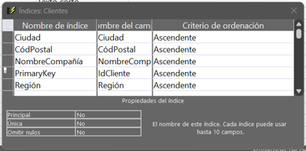

- Tipos de datos en Access (ayuda de Access en aplicación o internet):
  - Cuáles son y su descripción.
- **Tipos de datos comunes en Access:**
  - **Texto corto:** Texto alfanumérico (hasta 255 caracteres).
  - **Texto largo:** Textos extensos.
  - **Número:** Valores numéricos para cálculos.
  - **Fecha/Hora:** Fechas y horas.
  - **Moneda:** Valores monetarios.
  - **Autonumérico:** Números secuenciales automáticos.
  - **Sí/No:** Valores booleanos.
  - **Datos adjuntos:** Imágenes o archivos.
  - Dónde se pueden elegir
    - Se puede ver abriendo cualquier tabla
    - La forma más común es abriéndola en Vista Diseño tendremos un campo donde podremos seleccionar el tipo de datos junto al campo

    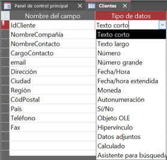

- - - La otra forma es abriendo la tabla en Vista de Hoja de Datos bajo la pestaña de campos de tabla hay un subapartado donde hay un desplegable donde también podemos seleccionarlo

    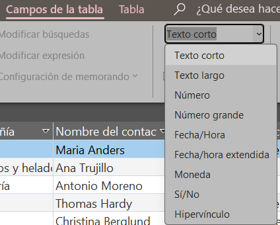

**Principales Propiedades de Valor en Access:**

- **Tamaño del campo:** Limita la cantidad de texto (caracteres) o define el rango numérico (Byte, Entero, Largo, Simple, Doble).
- **Formato:** Define cómo se visualizan los datos (por ejemplo, moneda, porcentaje, fecha, fijo) sin cambiar el valor almacenado.
- **Lugares decimales:** Especifica el número de decimales para tipos numéricos.
- **Máscara de entrada:** Facilita la entrada de datos forzando un formato específico (como teléfonos o códigos postales).
- **Valor predeterminado:** Asigna automáticamente un valor inicial en campos nuevos útil cuando un campo es mayoritariamente el mismo.
- **Regla de validación:** Establece condiciones (expresiones) que deben cumplirse para aceptar la entrada de datos, por ejemplo>0 o Entre 1 y 10.
- **Texto de validación:** Mensaje personalizado que aparece si no se cumple la regla de validación.
- **Requerido:** Obliga a que el campo no quede vacío ("Sí" o "No").
- **Indexado:** Acelera las búsquedas. Puede ser "Sí (con duplicados)" o "Sí (sin duplicados)" para claves únicas.

    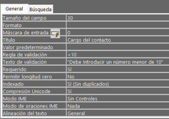

- Encontrar en Access los distintos tipos de dominios, clasificarlos en continuos y discretos para cada tipo de dato. (diapositivas)
- Buscar las propiedades siguientes de los campos en Access (explicarlas de forma

completa y localizar las pestañas donde se pueden elegir y modificar, hay que tener en cuenta que algunas dependen del tipo de datos de los campos) (ayuda de Access en aplicación o internet):

- - Tamaño de campo: Controla el límite de datos que puede almacenar el campo. - Para los distintos tipos de datos
- **Texto corto**: Máximo 255 caracteres. Se recomienda ajustarlo al tamaño real (ej. 2 para un código de provincia) para optimizar la base de datos.
- **Número**: Define la capacidad y precisión (Byte, Entero, Entero largo, Simple, Doble, Decimal). El más común para claves es Entero largo.

    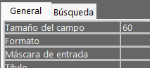
    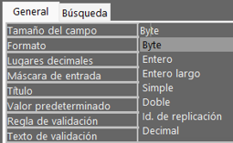

- - - Se pueden elegir desde Vista Diseño seleccionando un campo en la ventana de abajo
    - Formato de campo: Determina cómo se muestran los datos, no cómo se guardan.
      - **Predefinidos**: Para fechas (Fecha corta, Fecha larga), números (Moneda, Porcentaje) o valores lógicos (Sí/No).
      - **Personalizados:** Puedes usar símbolos. Por ejemplo, en un campo de texto, el símbolo > obliga a que todo se muestre en mayúsculas, mientras que < lo hace en minúsculas.
      - Cómo podemos definir nuestros propios formatos:
    - **Lugares decimales**: Solo disponible para tipos de datos numéricos y de moneda. Permite fijar el número de dígitos a la derecha de la coma decimal (de 0 a 15).
    - Para poder verlo hay que seleccionar el campo numérico como tipo de datos y en la pestaña general abajo veremos la propiedad Lugares decimales

    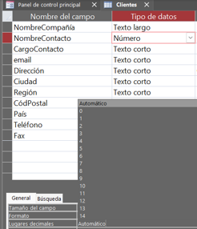

- - Máscara de entrada: Sirve para controlar el formato de la entrada de datos (ej. Números de teléfono o códigos postales). - Sintaxis empleada para personalizarla - 0: Dígito obligatorio. - 9: Dígito o espacio opcional. - L: Letra obligatoria. - ?: Letra opcional. - A: Letra o dígito obligatorio. - \>: Convierte a mayúsculas. - <: Convierte a minúsculas. - Explicación del asistente: Access nos ayuda con un asistente con formatos comunes. Para abrirlo tenemos que pinchar en los tres puntos …

    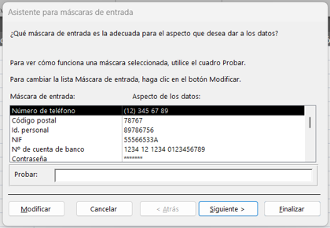

- - - Poner ejemplos y explicarlos para: NIF, Teléfono fijo y móvil, cuenta bancaria, otros

    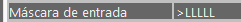

- - - Este por ejemplo pedirá introducir más de cinco letras y las convertirá a mayúsculas.

    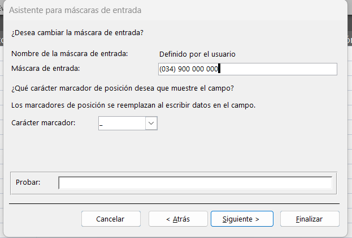

- - - En este caso configuramos para que la entrada sea un teléfono fijo español (prefijo +34) y que tenga 9 digitos

    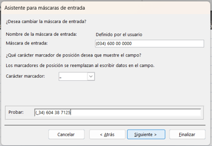

- - - En esto otro ejemplo configuramos la máscara de entrada para que la entrada de datos sea un número de teléfono móvil español
      - Como vemos nos da proporciona una vista previa para que nosotros probemos cómo funciona

    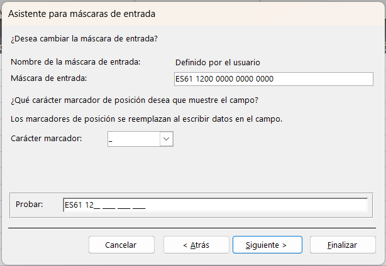

- - - En este otro ejemplo configuramos una cuenta para que la entrada sea una cuenta bancaria española de la entidad Caixabank
    - Título: Es la etiqueta que aparecerá en la parte superior de las columnas en la Vista Hoja de datos o en los formularios. Si no se pone nada, Access usa el nombre técnico del campo.

    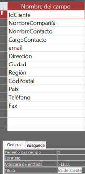
    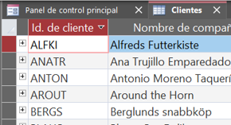

- - - Como vemos el nombre técnico es IdCliente, sin embargo, el nombre que aparece es el especificado en Título (Id. de cliente)
    - Valor predeterminado: Es el valor que se introduce automáticamente en un nuevo registro. Muy útil para fechas por ejemplo Fecha() o Hoy() o ciudades.

    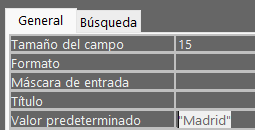
    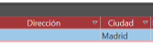

- - - Podemos hacer que el valor predeterminado sea Madrid por ejemplo

    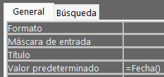
    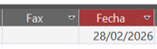

- - - O que el valor predeterminado para los nuevos registros sea la fecha de hoy.
    - Regla y texto de validación.
      - Lo que es:
        - Una regla de validación una expresión lógica que los datos deben cumplir para ser aceptados (ej. >0 para que no acepten números negativos).
        - Un texto de validación es un mensaje de error personalizado que aparecerá si el usuario intenta introducir un dato que no cumple la regla.
      - Uso del generador:
    

    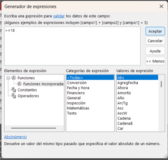
    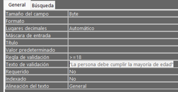

- El generador de expresiones nos ayudará a buscar funciones que nos ayuden, aunque si sabemos también podemos escribirlas de forma manual como he hecho en el ejemplo. Por ejemplo un campo de edad que solo admita un número mayor o igual a 18.
  - Requerido: Si se marca como **Sí**, el campo no puede quedar vacío al crear un registro. Es obligatorio para datos críticos.

    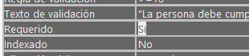

- - Permitir longitud cero: Específico para campos de texto. Permite que el usuario guarde una cadena vacía (""), lo cual es técnicamente distinto a un valor Nulo.

    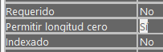

- - Valores nulos: Que admita campos vacíos que el usuario deje sin rellenar ninguna información. Si el campo es requerido entonces no puede contener valores nulos.

- **¿Cómo crear las relaciones en Access?** (ayuda de Access)
- Para ver, modificar o crear relaciones en Access tenemos que irnos a la pestaña de **Herramientas de base de datos** y seleccionar la opción Relaciones

    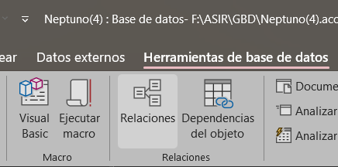

- Access permite crear relaciones arrastrando los campos que queremos relacionar

    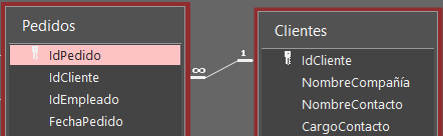

- **¿Cómo se modifica una relación ya creada en Access?** (ayuda de Access)
- Para modificar una relación en **Diseño de relaciones** podemos hacer clic en Modificar relaciones

    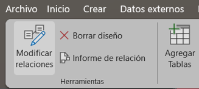

- También podemos hacerlo haciendo clic derecho sobre la línea que une ambas tablas

    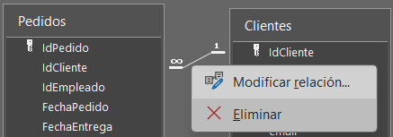

- **¿Cómo se borra una relación en Access?** (ayuda de Access)
- Al igual que en el segundo método de modificar una relación si hacemos clic sobre la línea que une dos tablas relacionadas la segunda opción nos permitirá eliminar la relación. Pulsar la tecla **supr** surtirá el mismo efecto.
- **¿Qué es la integridad referencial en Access y dónde se elige en una relación?** (diapositivas y ayuda de Access)
- Según lo visto en clase la integridad referencial es una restricción o regla que consiste en que no puede haber un valor en una clave ajena si antes no esta en la clave primaria a la que hace referencia con el objetivo de impedir tener registros que hacen referencia a datos inexistentes en otras tablas. Por ejemplo, impide crear un pedido para un cliente que no existe.
- En Access podemos exigirla o no desde la ventana de **Modificar relaciones**

    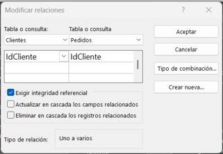

- **¿Qué es la actualización en cascada en Access y dónde se elige en una relación?** (diapositivas, y ayuda de Access)
- La actualización en cascada es una regla de integridad referencial que permite automatizar la sincronización automática entre tablas lo que significa que cuando se modifica un valor en la clave primaria de una tabla principal, el sistema actualiza automáticamente los valores correspondientes en las claves foráneas de las tablas secundarias relacionadas, garantizando la consistencia. Por ejemplo, si se cambia el id de un cliente en la tabla principal también se actualizará en todas las tablas secundarias donde aparezca ese cliente.
- En Access lo podemos habilitar desde la ventana de modificar relaciones. Cabe recalcar que debemos tener la opción de "Exigir integridad referencial habilitada"

    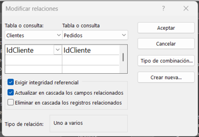

- **¿Qué es el borrado en cascada en Access y dónde se elige en una relación?** (diapositiva y ayuda de Access)
- El borrado en cascada es similar a la actualización en cascada. Significa que cuando se elimine un registro en la tabla principal que también se elimine los registros "hijos" en las tablas secundarias de manera que no queden registros desactualizados o que ya no existen.

    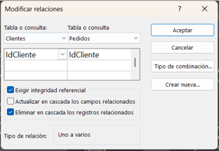

- **¿Dónde y cómo mostrar las relaciones directas en Access?** (ayuda de Access)
- En Access existe un botón específico para hacer eso dentro del apartado de Diseño de relaciones.
- Lo que nos permite ver es las relaciones que tiene la tabla que elijamos con otras tablas. Por ende, es necesario selecciona una o más tablas para poder usar el botón.

    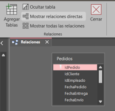

- **¿Dónde y cómo borrar todas las relaciones en Access?** (ayuda de Access)
- Lo podemos hacer haciendo clic en Mostrar todas las relaciones, seleccionando todas las tablas mediante el cuadro de selección o bien pulsando **CTRL + E** y seguido pulsando **supr**
- **¿Dónde y cómo ver todas las relaciones en Access?** (ayuda de Access)
- Lo podemos hacer desde el botón **Mostrar todas las relaciones** en Diseño de relaciones

    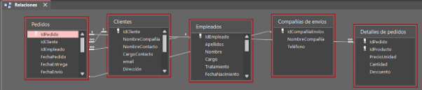

- **¿Dónde y cómo hacer un informe de las relaciones en Access**? (ayuda de Access)
- En la barra superior bajo el apartado de Diseño de relaciones encontraremos una opción llamada Informe de relación

    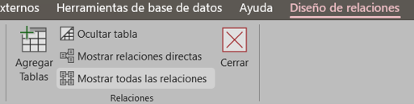
    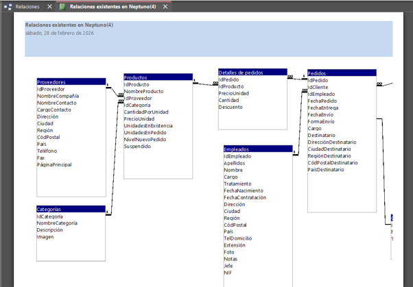

- **Sobre las restricciones del modelo relacional, obtener el mensaje que muestra Microsoft Access para las siguientes (con lo que habrá que incumplirlas)** (diapositivas)
  - **Restricciones generales:**
    - **Ausencia de tuplas (registros) repetidas (no hay dos tuplas iguales)**

    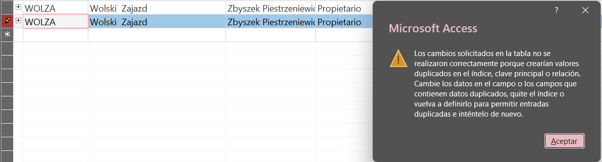

- Si intentamos copiar una fila no nos permitirá guardar
  - - **Irrelevancia del orden de las tuplas (registros).**
- Los datos se identifican por su contenido y claves primarias, no por su posición, permitiendo recuperar el orden deseado mediante consultas SQL sin importar el orden en que se almacenaron o donde se almacenen.
- Como vemos el programa nos permitirá filtrar la información en orden ascendente, descendente, etc.

    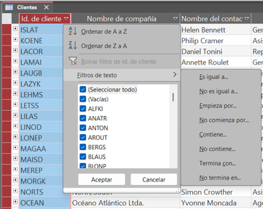

- - - **Irrelevancia del orden de los atributos (campos).**

    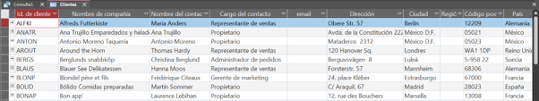

- Lo que significa es que no importa en que orden el campo esté establecido en la estructura de datos. Por ejemplo, podemos hacer una consulta que recupere los campos en otro orden.

    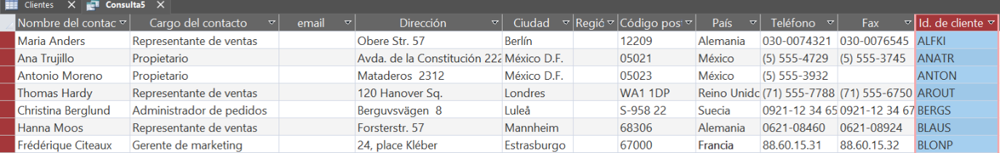

- - - **Cada atributo solo puede tomar un único valor del dominio al que pertenece.**

    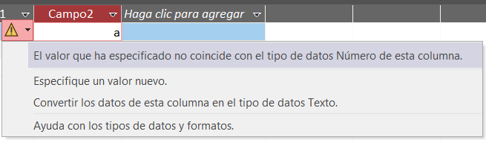

- Por ejemplo, si intento guardar una letra en un campo número no me dejará guardar el atributo.
  - **Restricciones de Integridad de clave**

    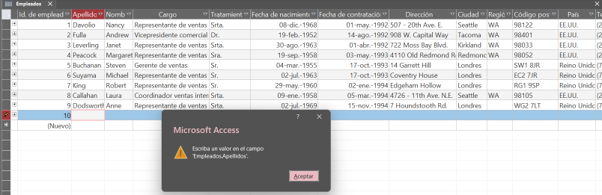

 Por ejemplo, si intento dejar una tupla en blanco me saltará este error

 

    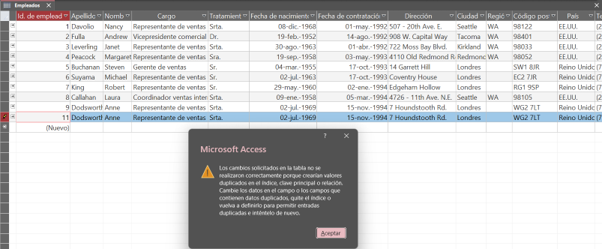

- Tampoco me dejará copiar una fila ya que no pueden haber dos filas iguales
  - **Restricciones de Integridad referencial**
    - Que no puede haber un valor en una clave ajena si antes no existe en la clave primaria a la que hace referencia

 

    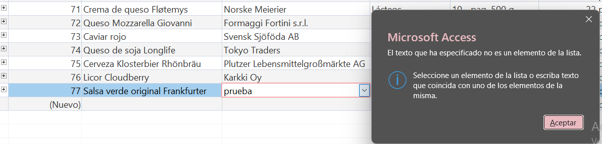

- Por ejemplo, en la tabla productos si escribimos un valor que no esté en la tabla original no nos dejará agregarlo
  - - En las claves ajenas se permiten valores nulos

 

    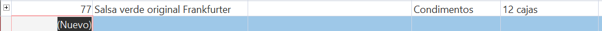

- En cambio, sí que podemos dejar huecos o registros vacíos
  - **Restricciones de Integridad de usuario o de dominio**
- Las condiciones impuestas en la definición de los dominios de un campo

 

    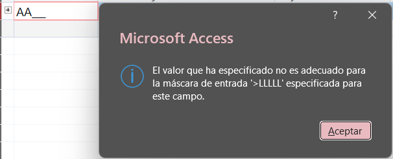
    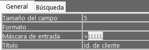

- Las condiciones impuestas a un campo en función del valor de otro

 

    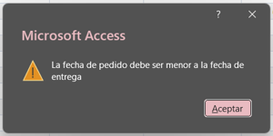
    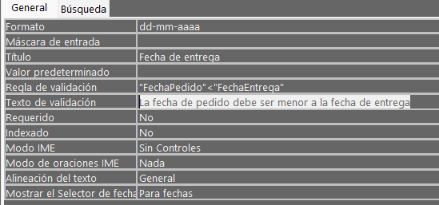

- - **Restricciones de verificación (CHECK)**

 

    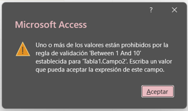
    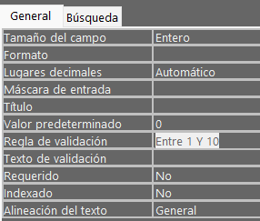

- **Sobre estas otras restricciones del modelo relacional, obtener el mensaje que muestra Microsoft Access para las siguientes:**
  - **Las columnas tienen un nombre que para una misma tabla tiene que ser único, por lo tanto, no puede haber columnas o campos duplicados** (diapositiva)

 

    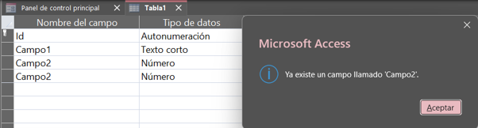

- Como vemos si intento crear dos campos con el mismo nombre me salta este error.
  - **El dominio de las claves secundarias ha de ser el mismo que el dominio de la clave primaria de la tabla a la que haga referencia** (diapositiva)

 

    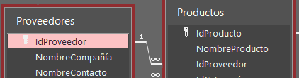

- Como vemos en la imagen la tabla Proveedores está relacionada con la tabla Productos mediante el campo IdProveedor

 

    

- Si yo en la tabla Productos intento cambiar el tipo de datos (dominio) del campo IdProveedor nos saltará el siguiente error.
  - **El valor de las claves secundarias puede estar duplicado** (diapositiva)

 

    

- Aquí lo que he hecho ha sido relacionar dos tablas que he creado y he exigido integridad referencial

 

    

- Si yo intento eliminar un registro relacionado en la tabla 1 (tabla principal/clave primaria) no me dejará eliminar ese registro

 

    

- Si por el contrario intento eliminar ese mismo registro (registro hijo) en la tabla 2 (clave secundaria) vemos que me advertirá, pero sí que me dejará eliminarlo
- **¿Cómo analizar el rendimiento de la base de datos?** (ayuda de Access)

 

    

- Desde **Herramientas de datos** hay una opción que nos permite hacer eso

 

    
    

- Su funcionamiento consiste en que seleccionamos los objetos que queremos analizar y el programa nos dará sugerencias e ideas para mejorar el rendimiento de la base de datos. Por ejemplo, añadir un índice a un campo.
- **¿Qué es compactar y reparar base de datos?** (ayuda de Access)

 

    

- Este botón lo que hace es reducir el archivo y corregir errores de la BBDD lo que mejora el rendimiento. Requiere acceso exclusivo, lo que significa que no debe haber otros usuarios conectados

**Beneficios y Funciones Principales:**

- Libera Espacio en Disco
- Mejora el Rendimiento
- Repara Daños Menores
- Optimización Preventiva
- **¿Cómo usar el documentador de base de datos?** (ayuda de Access)

 

    
    

- Su funcionamiento es similar al Analizador de rendimiento en lo que seleccionamos los objetos que queremos analizar
- En este caso nos arrojará un informe sobre los objetos donde se detallan las propiedades y configuraciones de estos.
- **Hacer una base de datos con una sola tabla, con algunos campos y rellenarla con 10 registros: (**diapositivas**)**
  - **Mostrar su cardinalidad y su grado con un pantallazo y la explicación que sea necesaria.**

 

    

- **Cardinalidad** en el contexto de una tabla se refiere al número de filas o tuplas en este caso 10.

 

    

- **Grado** se refiere al número de columnas o campos y esta tabla cuenta con 6