Contenido

[Objetivo](#objetivo)

[Inventario](#inventario)

[Ejecución](#ejecución)

[Preguntas](#preguntas)

[Consideraciones Finales](#consideraciones_finales)

# Objetivo

- Configuración de una máquina virtual con arranque dual de sistemas operativos Windows y Linux

# Inventario

- Imagen de disco de Windows y Linux (sus correspondientes ficheros .iso)
- Live CD de Ubuntu
- Creación de Máquina virtual con disco virtual de 50 Gigabytes

# Ejecución

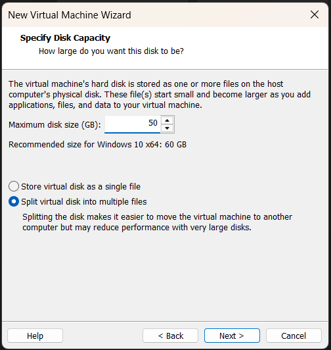

- Creamos una máquina virtual con VMWare.
- Especificamos que queremos el sistema operativo Windows con un disco virtual de 50GB.

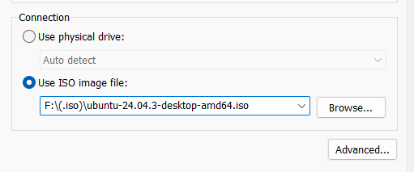

- Si bien le hemos indicado que su sistema operativo será Windows cargaremos el Live CD de Ubuntu para crear las particiones con GParted.

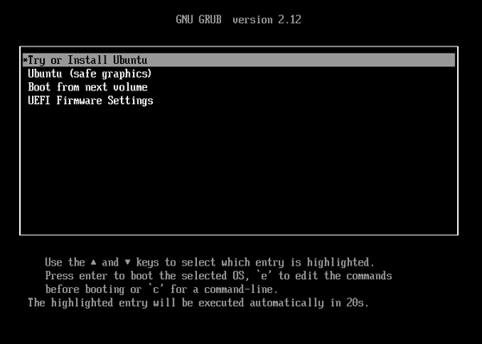

- Aquí damos a la primera opción. Traducido Probar o Instalar Ubuntu.

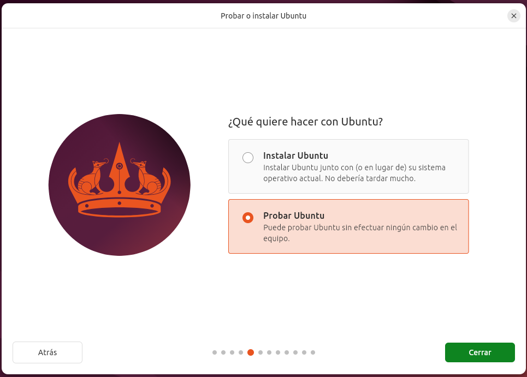

- Seleccionamos nuestro idioma, distribución de teclado y damos a Probar Ubuntu ya que no lo queremos instalar.

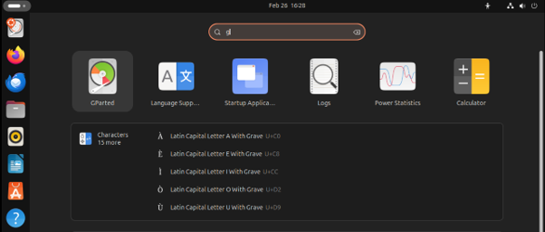

- Desde el menú buscamos e iniciamos Gparted

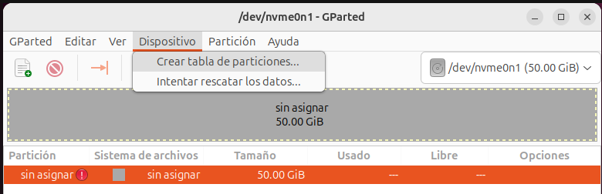

- Creamos una tabla de particiones

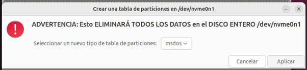

- Seleccionamos formato msdos que es lo mismo que MBR aunque también podría ser GPT.

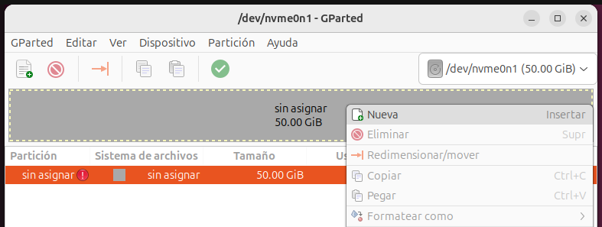

- Damos en Nueva para crear nuestras particiones

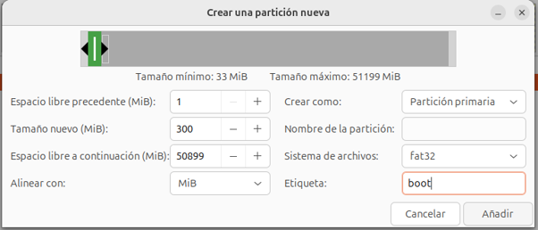

- Primero que nada, crearemos nuestra partición de arranque de 300MB con formato fat32

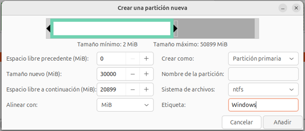

- Seguido crearemos nuestra partición de 30GB con el sistema de archivos ntfs y la etiquetamos con un nombre identificativo

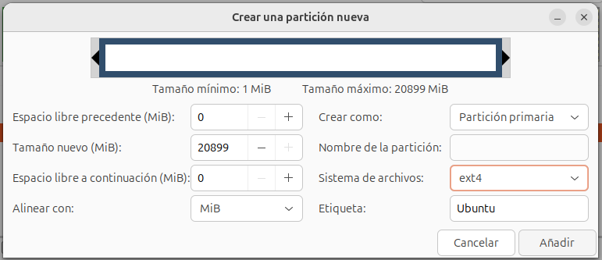

- Y ya, por último, crearemos nuestra partición de Ubuntu con el resto del espacio (20GB) con sistema de archivos ext4.

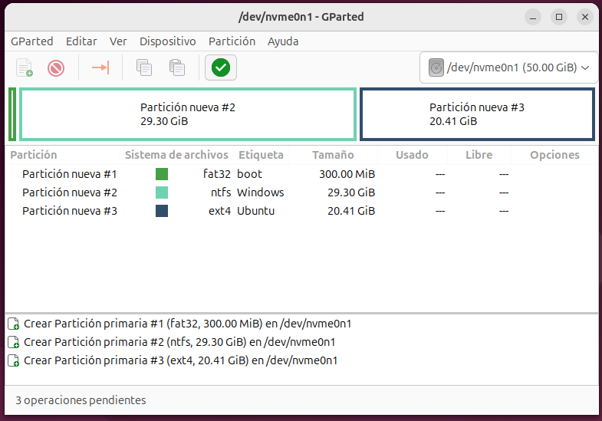

- Damos al check o visto en verde para aplicar los cambios realizados

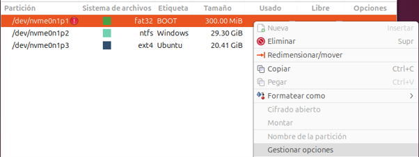
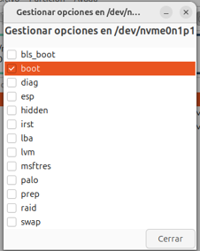

- Tras esto damos a Gestionar Opciones y marcamos la casilla "Boot"
- Esto le indicará al sistema operativo que la partición será arrancable o booteable.

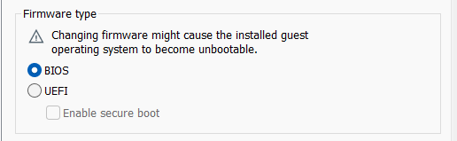

- Como hemos seleccionado MBR será de vital importancia seleccionar un firmware de tipo BIOS ya que UEFI solo trabaja con tablas de particiones de tipo GPT
- Como hemos cambiado la BIOS es posible que tengamos que seleccionar que queremos arrancar desde el CDROM pulsando "esc" para acceder a la BIOS

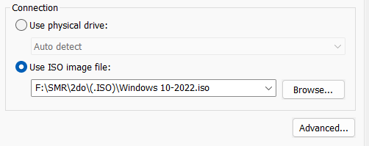

- Apagaremos nuestra máquina
- Introducimos el iso de Windows y la encendemos nuevamente
- Daremos a "Enter" para arrancar desde el CD

  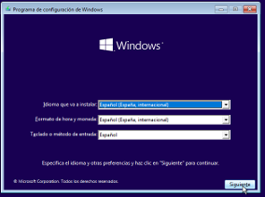
  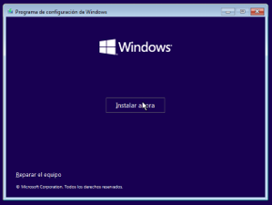
  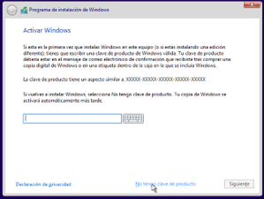
  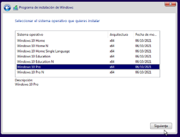
  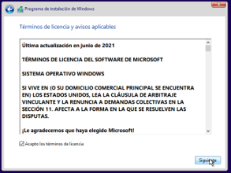
  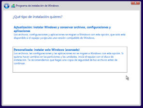    

- Proseguimos con la instalación del sistema operativo como es normal

  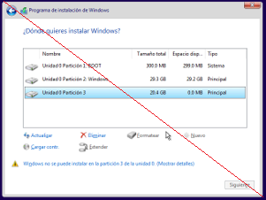
  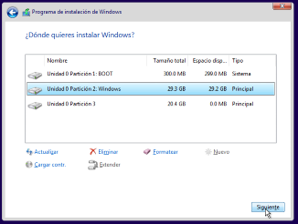    

- Como vemos no nos dejará instalar Windows en la partición de Linux al estar formateado con ext4
- En cambio, seleccionaremos la partición 2 de 29.3GB de Windows

  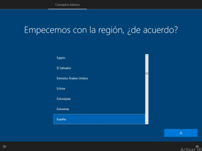
  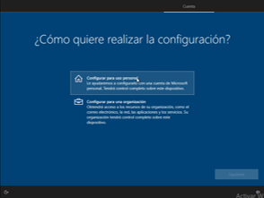
  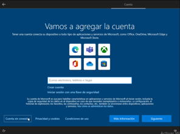
  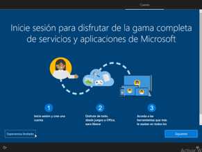  
  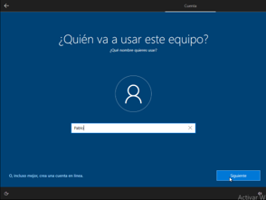
  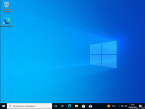          

- Proseguimos con la instalación de Windows como es habitual
- Una vez finalizada la instalación apagamos la máquina, introducimos el disco de Ubuntu y volvemos a iniciarla

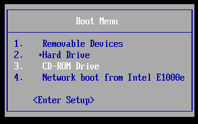

- Rápidamente pulsamos "ESC" y seleccionamos para cargar desde el disco como hemos hecho anteriormente.
- Dentro del menú de GRUB seleccionamos "Try or Install Ubuntu"

  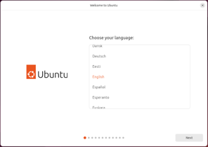
  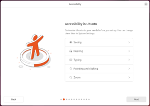
  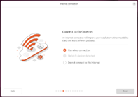
  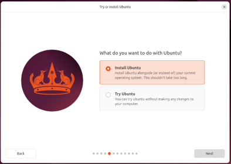          

- Proseguimos con la instalación de Ubuntu como es habitual y a diferencia de la vez anterior damos en la primera opción para instalar

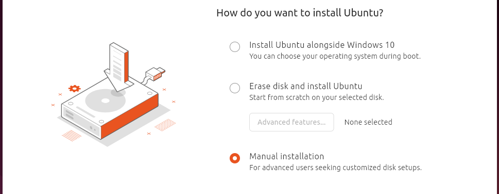

- Cuando lleguemos a este punto nos ofrecerá instalar Ubuntu junto a Windows. Esto seleccionará las particiones de forma automática. Sin embargo, para evitar equivocaciones del instalador seleccionaremos una instalación manual

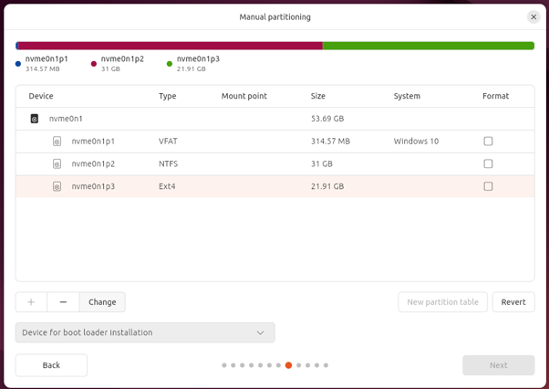

- En este caso como es Bios y no UEFI dejaremos la partición de arranque como está
- Seleccionamos la partición que hemos creado para Linux y damos en "_Change_"

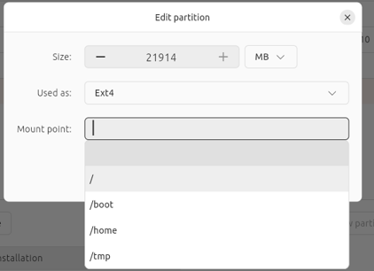

- En "_Used as_" dejamos ext4 y Mount Point o punto de montado seleccionamos / (root o el directorio raíz)

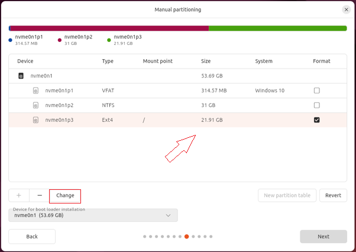

- Hecho eso, cuando nos aparezca el / en la columna de Mount Point damos a "_Next_"

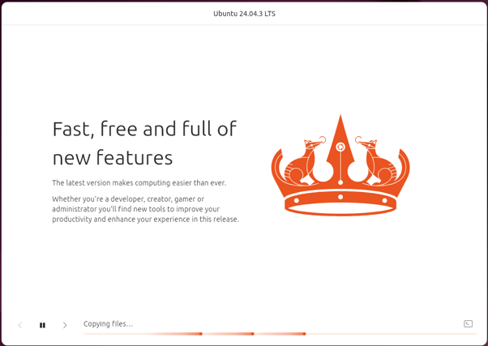

- Y continuamos con la instalación
- Si se congela a la mitad es aconsejable actualizar el instalador, tuve un problema con eso.

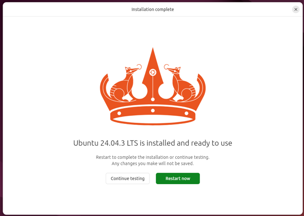

- Una vez acabado damos en "Restart now" o reiniciar ahora
- En mi caso, me arrancaba Ubuntu de primero entonces he hecho lo siguiente

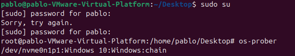

- Me he puesto en modo superusuario
- He comprobado que detectaba Windows 10
- He obligado actualizar Grub, el gestor de arranque

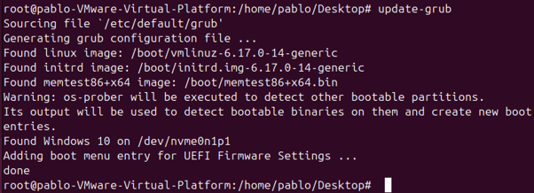

- Se han efectuado los cambios, ahora reiniciamos

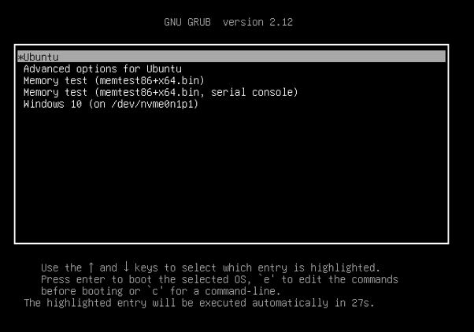

- Y como vemos ahora al reiniciar ya nos debería aparecer el menú de GRUB el cual nos permitirá arrancar tanto desde Ubuntu como Windows 10

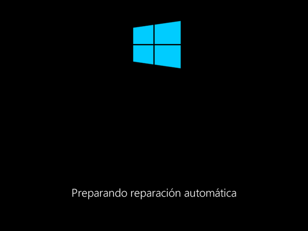

- La primera vez que ejecutamos Windows detecta que hemos hecho cambios, quizá nos pida reiniciar, pero en última instancia, lo permitirá

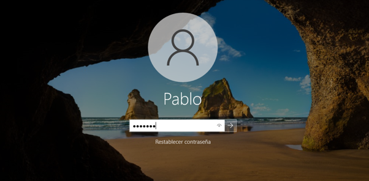
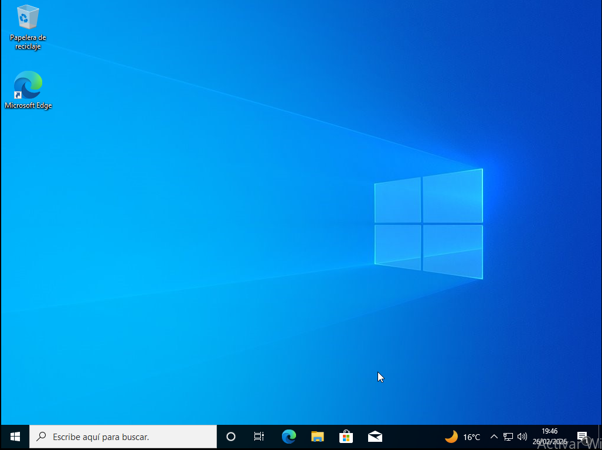

- Con esto concluye la práctica, muchas gracias.

# Preguntas

- ¿Por qué hay que instalar primero Windows y después Ubuntu? ¿Qué ocurre si lo instalas en orden inverso?

- Como fue explicado en clase Windows utiliza un gestor de arranque (Windows Boot Manager) que solo permite arrancar sistemas Windows. Windows sobrescribe el sector cero o gestor de arranque haciendo que el equipo inicie directamente Windows sin posibilidad de iniciar con Linux.
- Linux en cambio, tiene un gestor de arranque (GRUB) más amigable que si permite iniciar Windows como hemos atestiguado.

# Consideraciones Finales

- Esta práctica me ha ayudado a comprender mejor el particionamiento, los sistemas de archivos, las tablas de particiones y las diferencias entre estos.
