Contenido

[Objetivo](#objetivo)

[Inventario](#inventario)

[Ejecución](#ejecucion)

[Fdisk](#fdisk)

[Gparted](#gparted)

[Consideraciones Finales](#consideraciones-finales)

# Objetivo

El objetivo de esta práctica será particionar dos discos.

- En el primer disco crearemos:
  - 3 particiones primarias:
    - 1x 100 Mb
    - 1x 200 Mb
    - 1x 300 Mb (Activa)
- En el segundo disco crearemos:
  - 1x Partición primaria 200 Mb
  - 1x Partición extendida:
    - 1x unidad lógica 100 Mb
    - 1x unidad lógica 50 Mb
- Haremos esto mismo 3 veces:
  - La primera vez: con fdisk
  - La segunda vez: con Gparted
  - La tercera vez: con parted

# Inventario

Para ello necesitaremos una máquina virtual con las siguientes características:

- 1 CPU, 1 GB de RAM.
- Un HD de 2 Gbytes y otro HD de 4 Gbytes

# Ejecución

## Fdisk

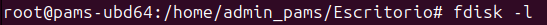
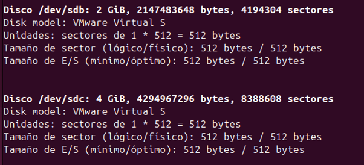

- Ejecutaremos el comando _fdisk -l_ para ver los discos, sus sectores y particiones.
- Como vemos los dos discos que hemos añadido el kernel les ha llamado sdb y sdc

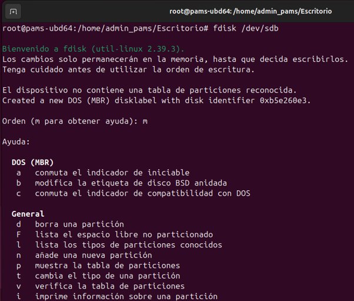

- Accedemos al primer disco con fdisk

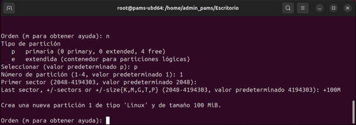

- Le decimos que queremos crear una partición 1 de tipo primaria y que ocupe 100Mb

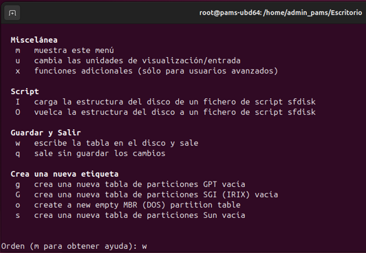

- Para salir y guardar lo hacemos con "W"

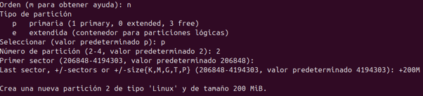

- Tras esto, crearemos la segunda partición de 200M

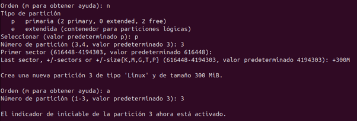

- Y la tercera de 300M
- Además, le decimos que queremos que sea activa con el modificador -a

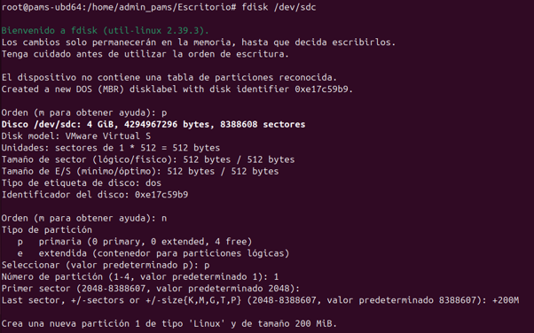

- Ahora accedemos al segundo disco y creamos una partición de tipo primaria de 200M

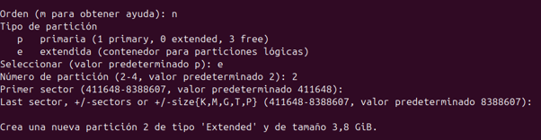

- Y ahora mediante el identificador -e creamos la segunda partición extendida

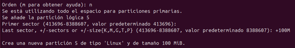

- Ahora la siguiente vez que creemos una partición creará automáticamente unidades lógicas. Creamos dos: la primera 100Mib y la segunda de 50Mib

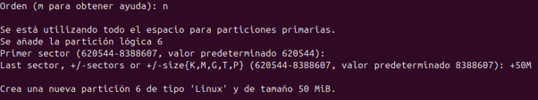

## Gparted

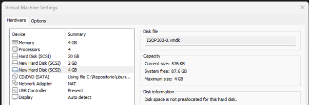

- Creamos una máquina con dos discos virtuales de las siguientes características:
  - 1er disco de 2 Gigabytes
  - 2do disco de 4 Gigabytes

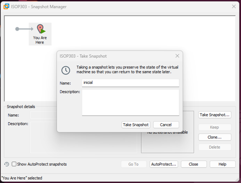

- Hemos hecho una Snapshot para poder volver al estado inicial.

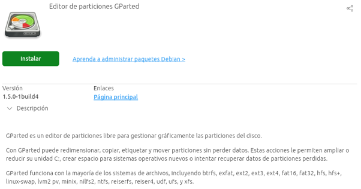

- Instalaremos GParted para realizar el particionamiento la primera vez.

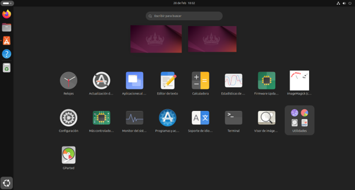

- Como vemos se nos instalará

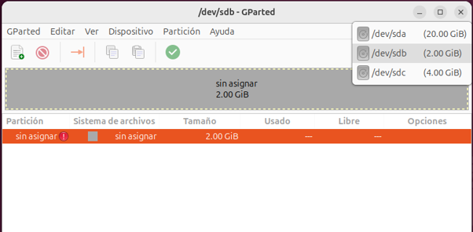

- Seleccionamos el primer disco

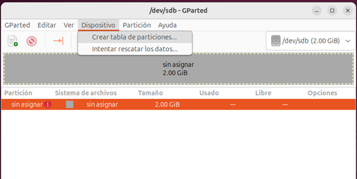

- Antes de crear particiones tendremos que crear una tabla de particiones.

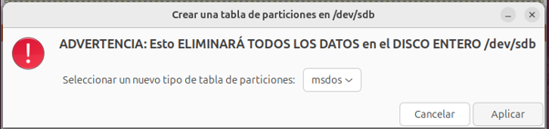

- Daremos a Aplicar. Nos advierte que hacer esto eliminará todos los datos en el disco

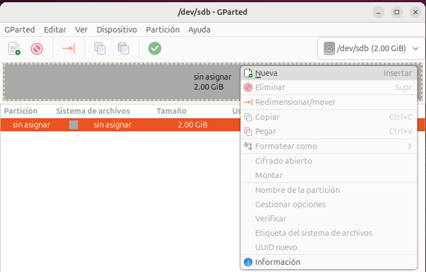

- Una vez creada la tabla de particiones podremos crear particiones

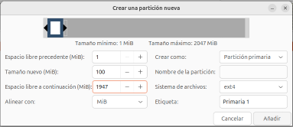
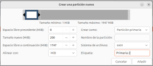
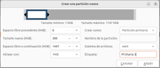

- Crearemos tres particiones primarias

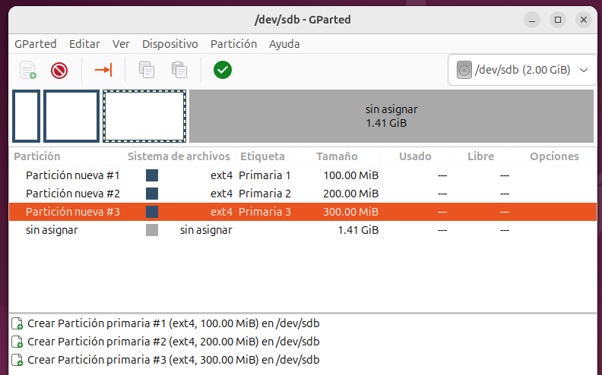
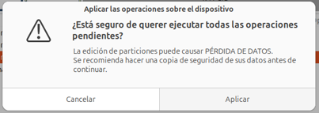
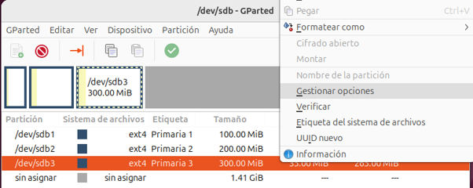
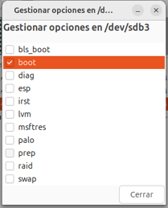
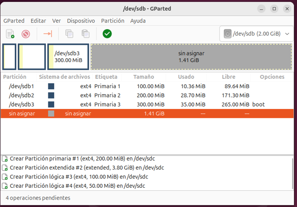
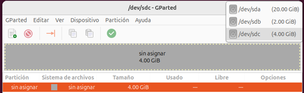

- Ahora seleccionamos el segundo disco y creamos una tabla de particiones.

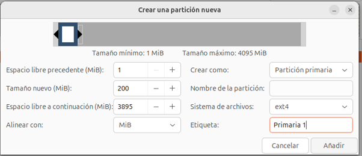

- Creamos una partición primaria de 200mb

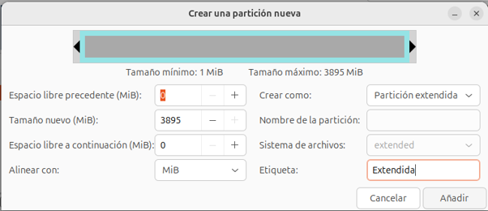

- Y una partición extendida con todo el tamaño libre que contendrá dos particiones lógicas

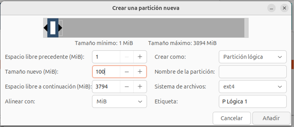
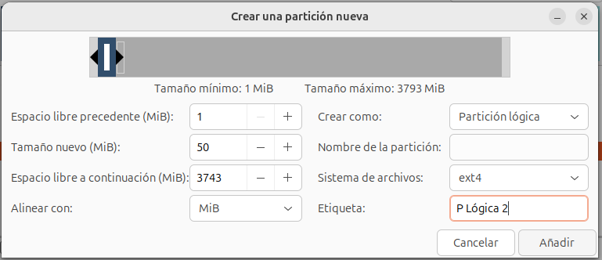

- Y dentro irán metidas las dos particiones lógicas

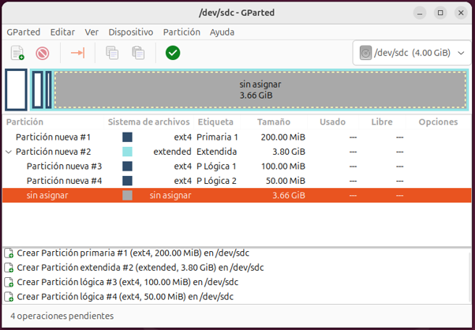

- Así quedaría nuestro segundo disco tras realizar las operaciones. Con esto concluye la práctica.

# Consideraciones Finales

- Como vemos existen diversas opciones para realizar el particionamiento de un disco. Tanto gráficas como por línea de comandos.
- Son útiles porque no siempre queremos que el sistema operativo elija por nosotros las particiones.