Contenido

[Objetivo](#objetivo)

[Inventario](#inventario)

[Explicación](#explicación)

[Ejecución](#ejecución)

[Comprobaciones](#comprobaciones)

[Consideraciones Finales](#consideraciones-finales)

# Objetivo

PARP604-RoutersLinux: Enrutamiento con sistemas GNU/Linux.

En el escenario propuesto tenemos tres máquinas con Ubuntu Server y tres máquinas con Ubuntu Desktop. Tenemos que configurar los tres enrutadores de manera que los clientes se pueden comunicar entre sí.

# Inventario

- 3x Ubuntu Server
- 3x Ubuntu Desktop

# Escenario Propuesto

El escenario de laboratorio está compuesto por un total de 6 máquinas virtuales distribuidas en una **topología en anillo**

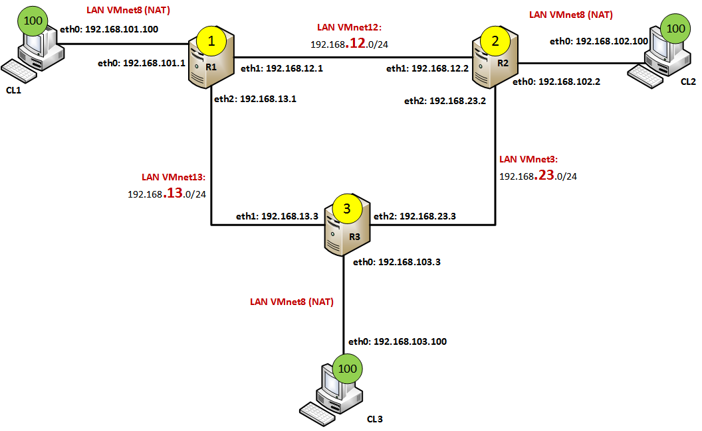

# Problemas a Solventar

- **Aislamiento de los Clientes:** Por defecto, los clientes se encuentran en dominios de difusión (redes) separados.
- **Limitación de Rutas Locales:** El router solo conoce las redes que tiene conectadas directamente a sus interfaces por lo que hay que crear una tabla de enrutamiento
- **Comportamiento de Host por Defecto en Linux:** Se debe cambiar el comportamiento por defecto del kernel de Linux para que permita la retrasmisión de los paquetes.

# Solución Propuesta

En mi caso, yo he decidido dividir la red en 6 segmentos LAN. De tal manera, configurare las máquinas virtuales con tres interfaces cada una en sus respectivos segmentos LAN para que adapten a este esquema.

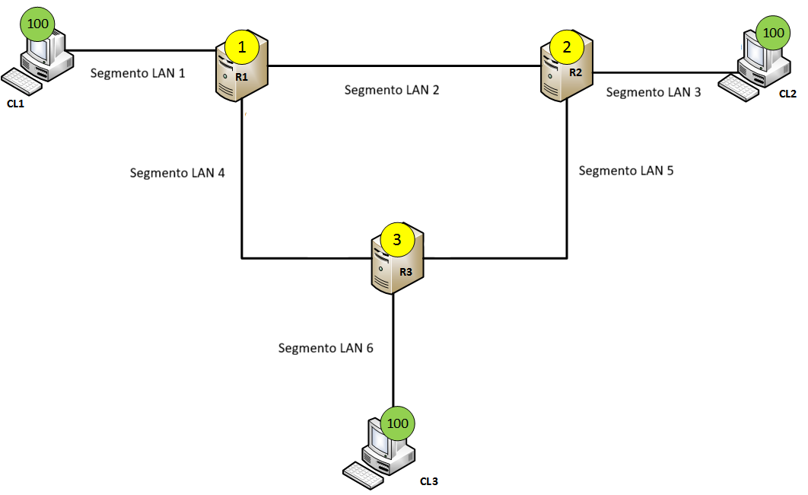

# Ejecución

El Router 1 contará con tres adaptadores de red configurados de la siguiente manera:

- Network Adapter 1: LAN Segment 1; MAC: 00:0C:29:5B:93:**A0**
- Network Adapter 2: LAN Segment 2; MAC: 00:0C:29:5B:93:**A1**
- Network Adapter 3: LAN Segment 4; MAC: 00:0C:29:5B:93:**A2**
- Así se vería nuestra tabla de enrutamiento:

| Concepto   | Interfaz de salida | IP de Interfaz de salida | Destino          | Puerta/Gateway |
| ---------- | ------------------ | ------------------------ | ---------------- | -------------- |
| Cliente 1  | ens33              | 192.168.101.1/24         | N/A              | N/A            |
| Cliente 2  | ens37              | 192.168.12.1/24          | 192.168.102.0/24 | 192.168.12.2   |
| Segmento 5 | ens37              | 192.168.12.1/24          | 192.168.23.0/24  | 192.168.12.2   |
| Cliente 3  | ens38              | 192.168.13.1/24          | 192.168.103.0/24 | 192.168.13.3   |

- Configuramos el fichero **.yaml** en /etc/netplan/ de la siguiente manera:

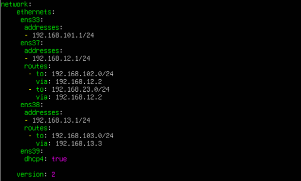

- Una vez guardamos el fichero será necesario ejecutar el comando sudo netplan apply para aplicar los cambios en la red
- Mediante el comando sudo nano editamos el fichero **sysctl.conf** en /etc/
- Descomentaremos la línea que dice _net.ipv4.ip_forward=1_ para habilitar el intercambio de paquetes entre máquinas.

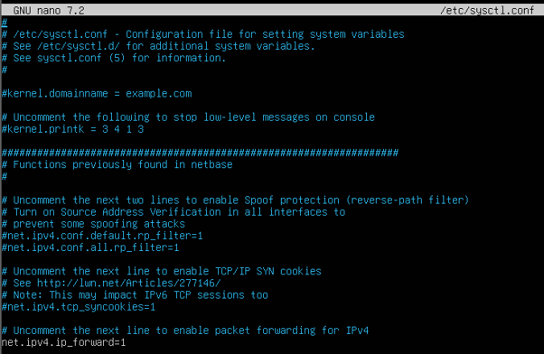

- Guardamos y seguido ejecutamos el comando sudo sysctl -p para aplicar los cambios

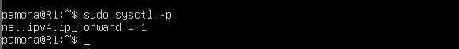

- Estos dos pasos lo repetiremos en los routers 2 y 3

El Router 2 contará con tres adaptadores de red configuradas de la siguiente manera:

- Network Adapter 1: LAN Segment 2; MAC: 00:50:56:26:A3:**B0**
- Network Adapter 2: LAN Segment 3; MAC: 00:50:56:26:A3:**B1**
- Network Adapter 3: LAN Segment 5; MAC: 00:50:56:26:A3:**B2**
- Así se vería nuestra tabla de enrutamiento:

| Concepto   | Interfaz de salida | IP de Interfaz de salida | Destino          | Puerta/Gateway |
| ---------- | ------------------ | ------------------------ | ---------------- | -------------- |
| Cliente2   | ens33              | 192.168.12.2/24          | 192.168.101.0/24 | 192.168.12.1   |
| Cliente1   | ens33              | 192.168.12.2/24          | 192.168.13.0/24  | 192.168.12.1   |
| Cliente3   | ens37              | 192.168.102.2/24         | N/A              | N/A            |
| Segmento 4 | ens38              | 192.168.23.2/24          | 192.168.103.0/24 | 192.168.23.3   |

- Configuramos el fichero **.yaml** en /etc/netplan/ de la siguiente manera:

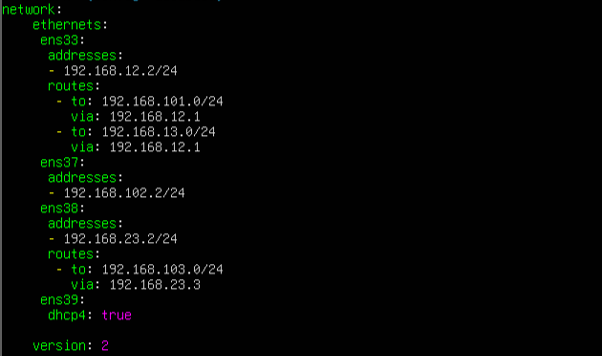

El Router 3 contará con tres adaptadores de red configuradas de la siguiente manera:

- Network Adapter: LAN Segment 4; MAC: 00:50:56:38:B9:**C0**
- Network Adapter 2: LAN Segment 5; MAC: 00:50:56:38:B9:**C1**
- Network Adapter 3: LAN Segment 6; MAC: 00:50:56:38:B9:**C2**
- Así se vería nuestra tabla de enrutamiento:

| Concepto | Interfaz de salida | IP de Interfaz de salida | Destino          | Puerta/Gateway |
| -------- | ------------------ | ------------------------ | ---------------- | -------------- |
| Cliente1 | ens33              | 192.168.13.3/24          | 192.168.101.0/24 | 192.168.13.1   |
| Cliente2 | ens37              | 192.168.23.3/24          | N/A              | N/A            |
| Cliente3 | ens38              | 192.168.103.3/24         | 192.168.102.0/24 | 192.168.23.2   |

- Configuramos el fichero **.yaml** en /etc/netplan/ de la siguiente manera:

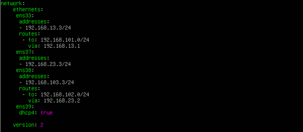

- El Cliente 1 contará con un adaptador de red configurado de la siguiente manera:
- Network Adapter: LAN Segment 1; MAC: 00:50:56:3D:**C1:01**
- Configuraremos el adaptador de red de forma manual de la siguiente manera:

| Dirección de Red | Máscara de Red | Puerta por Defecto       |
| ---------------- | -------------- | ------------------------ |
| 192.168.101.100  | Default        | 192.168.101.1 (Router 1) |

- Así se vería configurado desde la configuración:

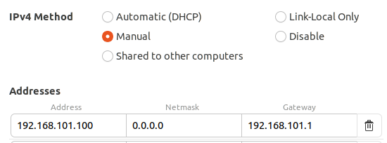

- Tendremos que asegurarnos que esta saliendo por esa puerta por defecto en detalles. Se recomienda reiniciar la interfaz después de guardar la nueva configuración.

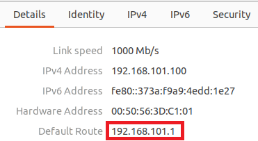

- El Cliente 2 contará con un adaptador de red configurado de la siguiente manera:
- Network Adapter: LAN Segment 3; MAC: 00:50:56:37:**C2:01**
- Configuraremos el adaptador de red de forma manual de la siguiente manera:

| Dirección de Red | Máscara de Red | Puerta por Defecto       |
| ---------------- | -------------- | ------------------------ |
| 192.168.102.100  | Default        | 192.168.102.2 (Router 2) |

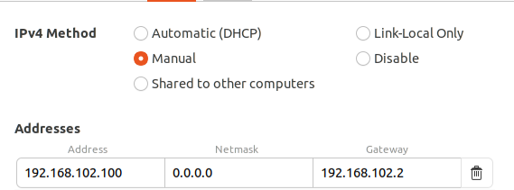

- El Cliente 3 contará con un adaptador de red configurado de la siguiente manera:
- Network Adapter: LAN Segment 6; MAC: 00:50:56:2B:**C3:01**
- Configuraremos el adaptador de red de forma manual de la siguiente manera:

| Dirección de Red | Máscara de Red | Puerta por Defecto       |
| ---------------- | -------------- | ------------------------ |
| 192.168.103.100  | Default        | 192.168.103.3 (Router 3) |

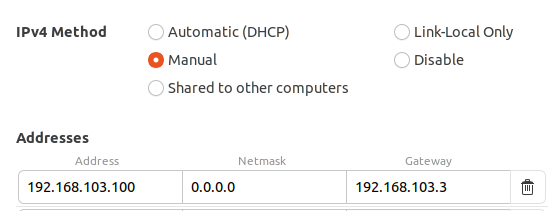

## Comprobaciones

Router 1

Ping a routers 2 y 3 por ambos extremos:

| Router   | Interfaz | Segmento | Dirección    |
| -------- | -------- | -------- | ------------ |
| Router 2 | ens33    | 2        | 192.168.12.2 |
| Router 2 | ens38    | 5        | 192.168.23.2 |
| Router 3 | ens33    | 4        | 192.168.13.3 |
| Router 3 | ens37    | 5        | 192.168.23.3 |

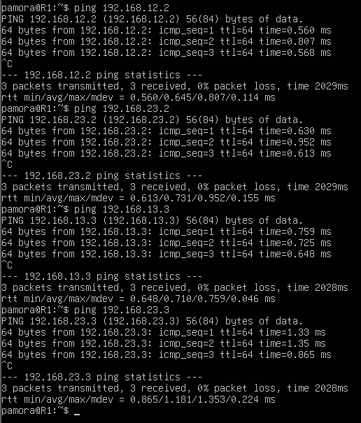

Router 2

Ping a router 1 y 3 por ambos extremos:

| Router   | Interfaz | Segmento | Dirección    |
| -------- | -------- | -------- | ------------ |
| Router 1 | ens33    | 2        | 192.168.12.1 |
| Router 1 | ens38    | 4        | 192.168.13.1 |
| Router 3 | ens33    | 4        | 192.168.13.3 |
| Router 3 | ens37    | 5        | 192.168.23.3 |

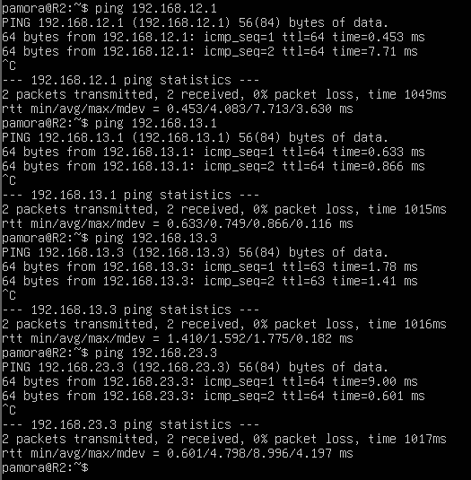

Router 3

Ping a router 1 y 2 por ambos extremos:

| Router   | Interfaz | Segmento | Dirección    |
| -------- | -------- | -------- | ------------ |
| Router 1 | ens38    | 4        | 192.168.13.1 |
| Router 1 | ens37    | 2        | 192.168.12.1 |
| Router 2 | ens38    | 5        | 192.168.23.2 |
| Router 2 | ens37    | 2        | 192.168.12.2 |

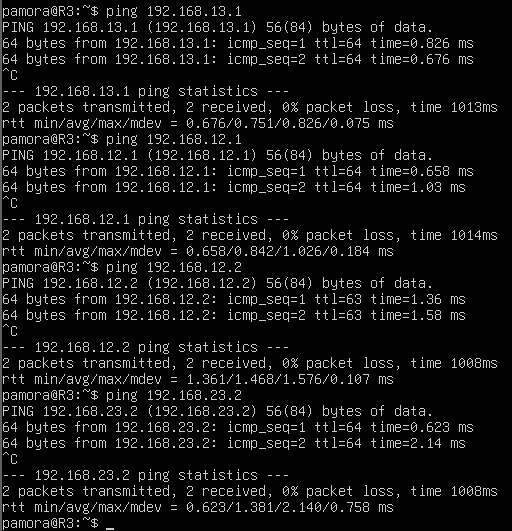

Cliente 1

- Traceroute a cliente 2 y 3

| Interfaz de Salida | Gateway       | Salto 1      | Destino         |
| ------------------ | ------------- | ------------ | --------------- |
| 192.168.101.100    | 192.168.101.1 | 192.168.12.2 | 192.168.102.100 |
| 192.168.101.100    | 192.168.101.1 | 192.168.13.3 | 192.168.103.100 |

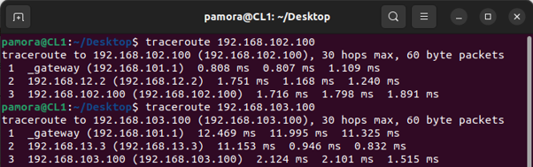

- Tendremos que instalar la herramienta traceroute en los clientes para poder ejecutar el comando

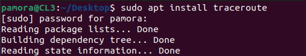

Cliente 2

Traceroute a cliente 1 y 3

| Interfaz de Salida | Gateway       | Salto 1      | Destino         |
| ------------------ | ------------- | ------------ | --------------- |
| 192.168.102.100    | 192.168.102.2 | 192.168.12.1 | 192.168.101.100 |
| 192.168.102.100    | 192.168.102.2 | 192.168.23.3 | 192.168.103.100 |

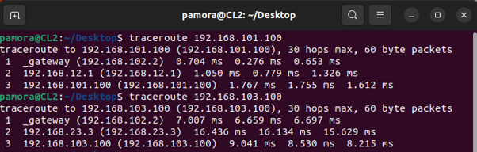

Cliente 3

Traceroute a cliente 1 y 2

| Interfaz de Salida | Gateway       | Salto 1      | Destino         |
| ------------------ | ------------- | ------------ | --------------- |
| 192.168.103.100    | 192.168.103.3 | 192.168.13.1 | 192.168.101.100 |
| 192.168.103.100    | 192.168.103.3 | 192.168.23.2 | 192.168.102.100 |

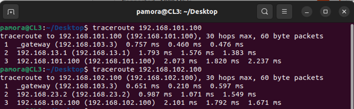

# Consideraciones Finales

- Como vemos configurar el enrutamiento en Linux y al igual que en Windows es fácil una vez que tienes hecho tu diagrama y/o tabla de enrutamiento.
- No deberíamos ponernos a configurar las direcciones IP sin antes haber realizado este paso