Contenido

[Objetivo](#objetivo)

[Inventario](#inventario)

[Ejecución](#ejecucion)

[Esquema de Red](#esquema-de-red)

[Comprobaciones](#comprobaciones)

[Consideraciones Finales](#consideraciones-finales)

# Objetivo

**PARP605-RoutersWINLinux**: Escenario de enrutamiento libre mixto Windows/Linux.

Elegir un escenario de enrutamiento libre, que debe componerse de al menos tres routers.  
Se trata de que haya routers tanto WIN como Linux (1WIN+2Linux o 2WIN+1Linux).

# Inventario

- 1x enrutador Windows Server 2022
- 2x enrutadores Ubuntu Server
- 1x cliente con Windows 10
- 2x clientes con Ubuntu Desktop

# Esquema de Red

El escenario de laboratorio está compuesto por un total de 6 máquinas virtuales distribuidas en una **topología en anillo**. He procurado usar rangos de direcciones de clase A, B y C

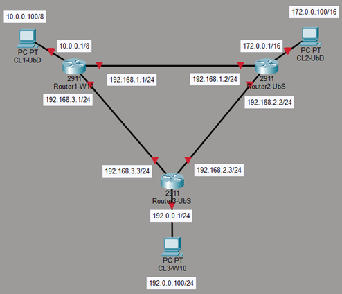

# Ejecución

El Router 1 contará con tres adaptadores de red configurados de la siguiente manera:

- Network Adapter 1: NAT (No conectado)
- Network Adapter 2: LAN Segment 1; MAC: 00:0C:29:27:**A1:01**
- Network Adapter 3: LAN Segment 2; MAC: 00:0C:29:27:**A1:02**
- Network Adapter 4: LAN Segment 4; MAC: 00:0C:29:27:**A1:03**
- Así se vería nuestras conexiones de red:

| Concepto   | Interfaz de salida | IP de Interfaz de salida | Puerta/Gateway |
| ---------- | ------------------ | ------------------------ | -------------- |
| Segmento 1 | Ethernet1          | 10.0.0.1/8               | N/A            |
| Segmento 2 | Ethernet2          | 192.168.1.1/24           | 192.168.1.2    |
| Segmento 4 | Ethernet3          | 192.168.3.1/24           | 192.168.3.3    |

- En Windows Server tendremos que instalar y habilitar el servicio de enrutamiento:

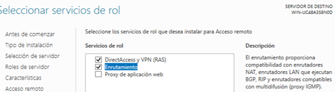
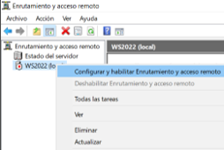
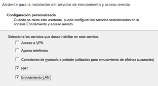

- También crearemos una regla para que sea posible realizar ping desde el router 2 y 3

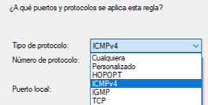
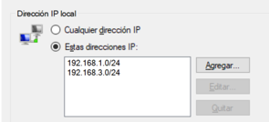

- No explico en profundidad estos pasos porque ya los he documentado en la práctica anterior
- En Windows no se pueden configurar rutas estáticas de manera gráfica por lo que las configuraremos por línea de comandos
- Le indicaremos que salga por la 192.168.3.3 para conectarse a la red 192.0.0.0 para poder conectarse al cliente 3

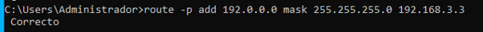

- Le indicaremos que salga por la IP 192.168.1.2 para conectarse a la red 192.168.2.0 por el otro extremo. Esto lo hacemos para poder comunicarnos con la otra interfaz de Router 2

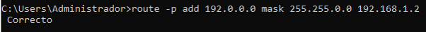

- Para salir a la red del cliente 2 le indicaremos que salga por la 192.168.1.2 (segmento 2)

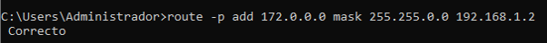

- Al final me ha quedado así la configuración. Esto lo podemos ver con Route Print

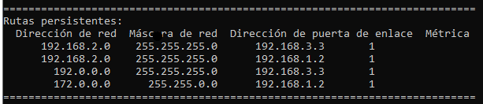

El Router 2 contará con tres adaptadores de red configurados de la siguiente manera:

- Network Adapter 1: NAT (No usado)
- Network Adapter 2: LAN Segment 2; MAC: 00:50:56:38:**A2:03**
- Network Adapter 3: LAN Segment 3; MAC: 00:50:56:31:**A2:02**
- Network Adapter 4: LAN Segment 5; MAC: 00:50:56:31:**A2:01**
- Así se vería nuestra tabla de enrutamiento:

| Concepto                | Interfaz de salida | IP de Interfaz de salida | Destino        | Puerta/Gateway |
| ----------------------- | ------------------ | ------------------------ | -------------- | -------------- |
| NAT                     | ens33              | DHCP                     | N/A            | N/A            |
| Cliente 1               | ens37              | 192.168.1.2/24           | 10.0.0.0/8     | 192.168.1.1    |
| Router 1 (otro extremo) | ens37              | 192.168.1.2/24           | 192.168.3.0/24 | 192.168.1.1    |
| Cliente 2               | ens38              | 172.0.0.1/16             | N/A            | N/A            |
| Cliente 3               | ens39              | 192.168.2.2/24           | 192.0.0.0/24   | 192.168.2.3    |
| Router 3 (otro extremo) | ens39              | 192.168.2.2/24           | 192.168.3.0/24 | 192.168.2.3    |

- Configuramos el fichero **.yaml** en /etc/netplan/ de la siguiente manera:

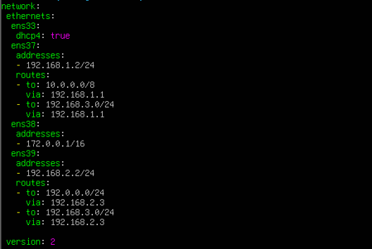

- Una vez guardamos el fichero será necesario ejecutar el comando sudo netplan apply para aplicar los cambios en la red
- Mediante el comando sudo nano editamos el fichero **sysctl.conf** en /etc/
- Descomentaremos la línea que dice _net.ipv4.ip_forward=1_ para habilitar el intercambio de paquetes entre máquinas.

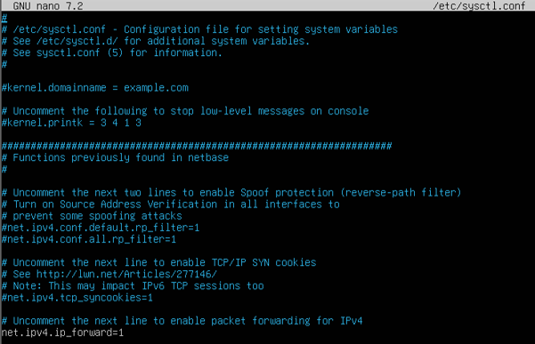

- Guardamos y seguido ejecutamos el comando sudo sysctl -p para aplicar los cambios

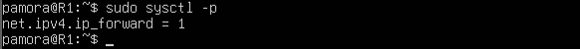

- Estos dos pasos lo repetiremos en el router 3

El Router 3 contará con tres adaptadores de red configurados de la siguiente manera:

- Network Adapter 1: NAT (No usado)
- Network Adapter 2: LAN Segment 4; MAC: 00:50:56:23:**A3:01**
- Network Adapter 3: LAN Segment 5; MAC: 00:50:56:2C:**A3:02**
- Network Adapter 4: LAN Segment 6; MAC: 00:50:56:24:**A3:03**
- Así se vería nuestra tabla de enrutamiento:

| Concepto                | Interfaz de salida | IP de Interfaz de salida | Destino        | Puerta/Gateway |
| ----------------------- | ------------------ | ------------------------ | -------------- | -------------- |
| NAT                     | ens33              | DHCP                     | N/A            | N/A            |
| Cliente 1               | ens37              | 192.168.3.3/24           | 10.0.0.0/8     | 192.168.3.1    |
| Router 1 (otro extremo) | ens37              | 192.168.3.3/24           | 192.168.1.0/24 | 192.168.3.1    |
| Cliente 3               | ens38              | 192.168.2.3/24           | 172.0.0.0/16   | 192.168.2.2    |
| Router 2 (otro extremo) | ens38              | 192.168.2.3/24           | 192.168.1.0/24 | 192.168.2.2    |
| Cliente 2               | ens39              | 192.0.0.1/24             | N/A            | N/A            |

- Configuramos el fichero **.yaml** en /etc/netplan/ de la siguiente manera:

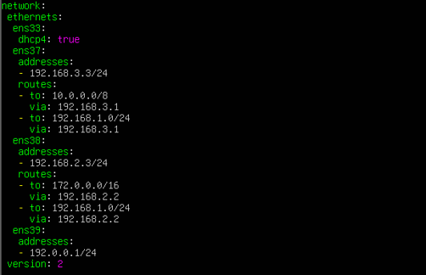

- Una vez guardamos el fichero será necesario ejecutar el comando sudo netplan apply para aplicar los cambios en la red

El Cliente 1 contará con tres adaptadores de red configurados de la siguiente manera:

- Network Adapter 1: NAT (No conectado)
- Network Adapter 2: LAN Segment 1; MAC: 00:0C:29:1F:**C1:01**
- Así se vería nuestras conexiones de red:

| Concepto   | Interfaz de salida | IP de Interfaz de salida | Default Gateway/Puerta Por Defecto |
| ---------- | ------------------ | ------------------------ | ---------------------------------- |
| Segmento 1 | Ens37              | 10.0.0.100/8             | 10.0.0.1                           |

El Cliente 2 contará con tres adaptadores de red configurados de la siguiente manera:

- Network Adapter 1: NAT (No conectado)
- Network Adapter 2: LAN Segment 1; MAC: 00:0C:29:1F:**C2:01**
- Así se vería nuestras conexiones de red:

| Concepto   | Interfaz de salida | IP de Interfaz de salida | Default Gateway/Puerta Por Defecto |
| ---------- | ------------------ | ------------------------ | ---------------------------------- |
| Segmento 3 | Ens37              | 172.0.0.100/16           | 172.0.0.1                          |

Cliente 3

El Cliente 2 contará con tres adaptadores de red configurados de la siguiente manera:

- Network Adapter 1: NAT (No conectado)
- Network Adapter 2: LAN Segment 1; MAC: 00:0C:29:1F:**C3:01**
- Así se vería nuestras conexiones de red:

| Concepto   | Interfaz de salida | IP de Interfaz de salida | Default Gateway/Puerta Por Defecto |
| ---------- | ------------------ | ------------------------ | ---------------------------------- |
| Segmento 6 | Ens37              | 192.0.0.100/24           | 192.0.0.1                          |

- Será necesario configurar una regla de firewall para permitir el trafico ICMP. (Ping usa ese protocolo)

## Comprobaciones

Router 1: Ping a router 2 y 3 por ambos extremos

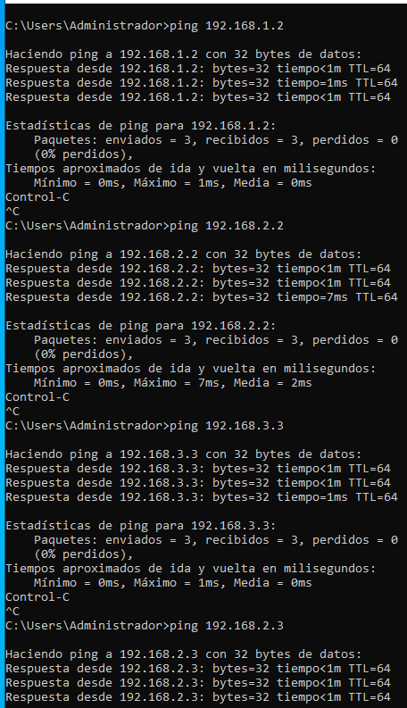

Router 2: Ping a router 1 y 3 por ambos extremos

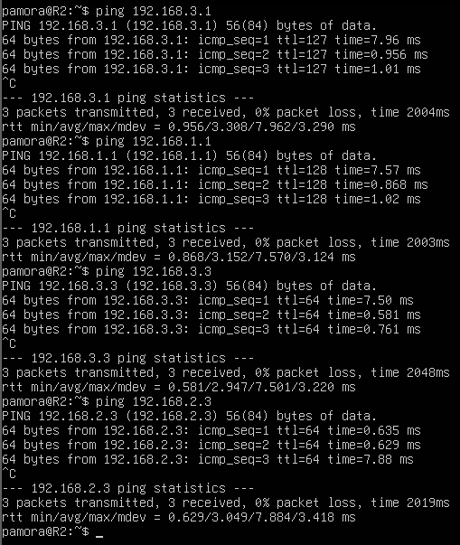

Router 3: Ping a router 1 y 2 por ambos extremos

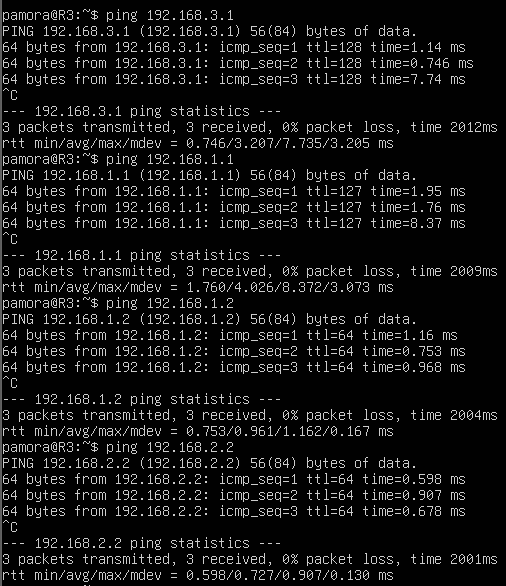

Cliente 1: Tracer/Traceroute a Cliente 2 y 3

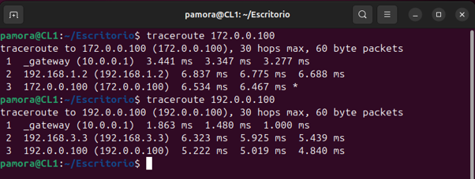

Cliente 2: Tracer/Traceroute a Cliente 1 y 3

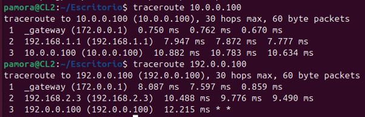

Cliente 3: Tracer/Traceroute a Cliente 1 y 2

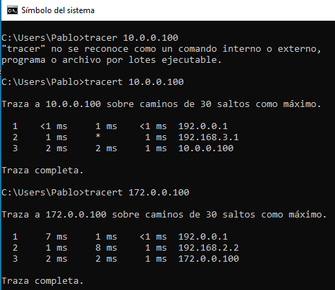

# Consideraciones Finales

- Como vemos el escenario híbrido (Windows con Linux) se configura de manera bastante similar. La única complicación que podemos sufrir puede ser con el firewall de Windows para ello hemos de crear una regla de firewall ICMP así como configurar las rutas estáticas persistentes al no tener una forma gráfica de configurarlas.
