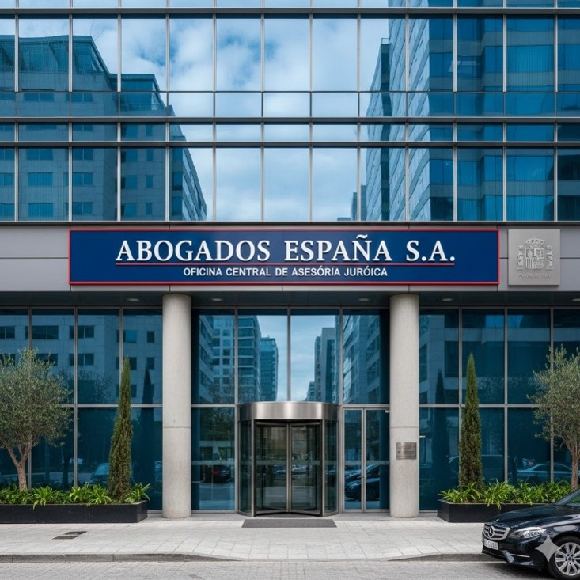
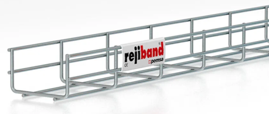
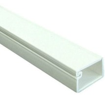
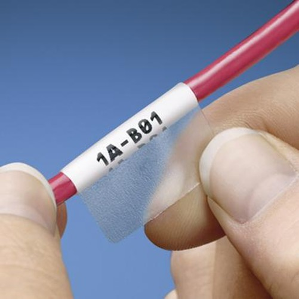
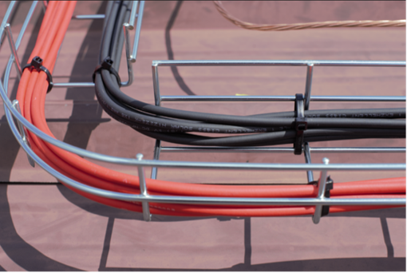
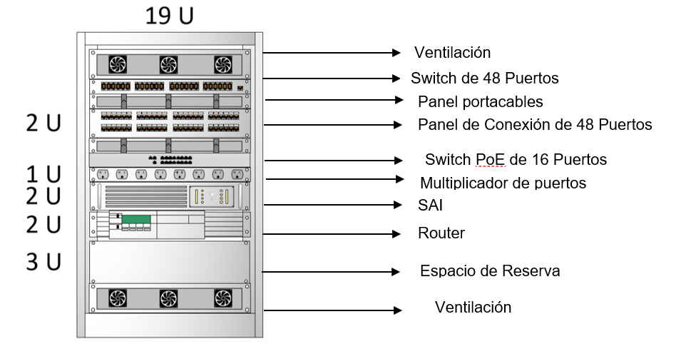
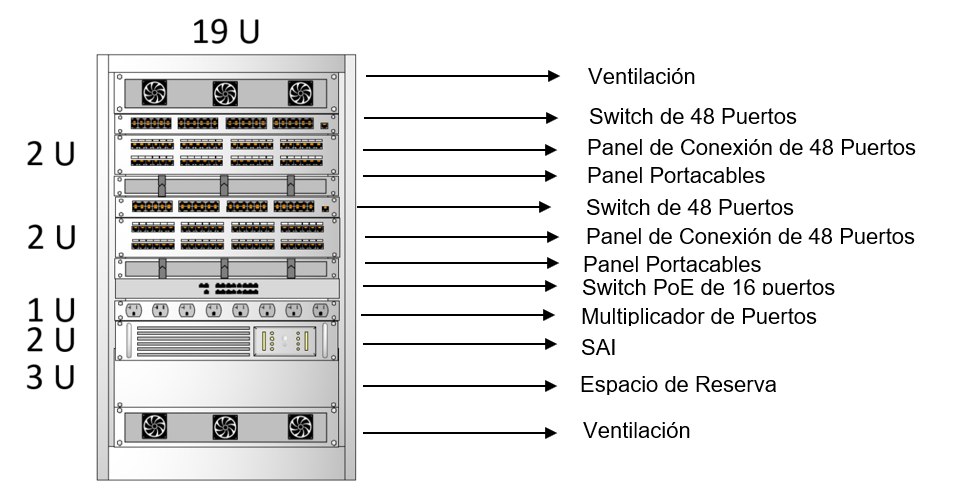

> **Curso:** ASIR1
>
> **Alumno:** Pablo Andrés Mora Suárez
>
> **Nº Lista:** 14
>
> **Profesor:** Alfredo Abad
>
> **Módulo**: PAR
>
> **Fecha:** 07/01/2025
>
> **PARP301:** Proyecto de Cableado Estructurado en una oficina de dos plantas

# Contenido

- [Introducción](#introducción)

- [Planos originales](#planos-originales)

  - [Planta 1](#planta-1)

  - [Planta 2](#planta-2)

- [Situación del edificio](#situación-del-edificio)

- [Especificaciones del cliente](#especificaciones-del-cliente)

- [Objetivos del proyecto](#objetivos-del-proyecto)
 
- [Soluciones Propuestas](#soluciones-propuestas)
 
- [Elección y compra de materiales](#elección-y-compra-de-materiales)
 
  - [Subsistema de Cableado Horizontal](#subsistema-de-cableado-horizontal)
  
  - [Subsistema de Cableado Vertical](#subsistema-de-cableado-vertical)
  
  - [Racks de la Planta 1 y 2](#racks-de-la-planta-1-y-2)
  
  - [Elementos del Rack de la Planta 1 y 2](#elementos-del-rack-de-la-planta-1-y-2)
 
- [Planos posteriores](#planos-posteriores)
 
  - [Planta 1](#planta-1-1)
  
  - [Planta 2](#planta-2-1)
 
- [Topología De La Red](#topología-de-la-red)
 
- [Subsistemas De Red](#subsistemas-de-red)

- [Cronograma / Diagrama de Gantt](#cronograma-diagrama-de-gantt)
 
- [Inventario Cables](#inventario-cables)

- [Etiquetado de los cables](#etiquetado-de-los-cables)
 
- [Inventario de tomas de datos](#inventario-de-rosetas-y-puntos-de-red)
 
- [Presupuesto](#presupuesto)
 
- [Contrato](#contrato)

# Introducción

## El Cliente

**Abogados España S.A** es un Despacho especializado con más de 25 años
de experiencia prestando servicios jurídicos en Madrid, así como el
resto de España. Cuenta con Abogados expertos en extranjería, así como
otras especialidades del Derecho. Este año han decidido mudar sus
oficinas ubicadas en la calle Orense para ampliar y modernizar sus
instalaciones a un edificio empresarial de varias plantas. Sin embargo,
antes de migrar todo el mobiliario y sus trabajadores, es necesario
cablear el edificio por lo que han solicitado nuestros servicios.

## El Contratista

**CE Solutions** es una empresa de ingeniería de sistemas con sede en
Madrid, especializada en el diseño, despliegue y certificación de
infraestructuras de telecomunicaciones. Fundada por *Pablo Andres Mora
Suarez,* nuestra firma nace como una startup en 2025 con la misión de
transformar el cableado pasivo en un activo estratégico para las
empresas que no pueden permitirse fallos de conexión.

# PLANOS ORIGINALES

## Planta 1

**Características:**

- 15 Oficinas Privadas

- 3 Salas de Apoyo

  - Recepción

  - Sala de Conferencias

  - Sala de Descanso

  - Cuarto de Almacenamiento

    - Sala de Telecomunicaciones (TD) / Sala de Equipamiento (ER)

      - Rack

- Trabajadores (estimado):

  - 1era Planta

    - 15 abogados

    - 1 recepcionista

      - Total: 16 trabajadores

- Dimensiones:

  - Largo: 75 Pies = 22,86 Metros

  - Ancho: 47 Pies = 14,32 Metros

## Planta 2

**Características**:

- 23 Oficinas Privadas

- 4 Salas De Apoyo

  - Sala De Copiado

  - Sala De Descanso

  - Librería

  - Sala De Telecomunicaciones (TD)

  - Cuarto de Limpieza

  - Cuarto de Configuración

  - Cuarto de Almacenamiento

- Trabajadores (estimado):

  - 2da Planta

    - 23 abogados

    - 1 administrativo

    - 1 fotocopiador

    - 4 paralegales

      - Total: 29 trabajadores

- Total (entre ambas plantas): 45 trabajadores

- Dimensiones:

  - Largo: 152 Pies = 46,3 Metros

  - Ancho: 55 Pies = 16,7 Metros

# Situación del edificio

El edificio empresarial en la Calle Orense, 40 fue construido a mediados
de los años 80 y presenta una estructura de hormigón armado macizo y una distribución eléctrica que no fue diseñada para la densidad de los dispositivos digitales actuales. Al ser un edificio antiguo, no existen "patinillos" por lo que la comunicación entre plantas sube por un tubo rígido de acero (EMT) atravesando el hormigón. Además, las paredes son de ladrillo macizo lo que impide el paso de cables por el interior.

Salvo en una sala de la 1era planta no hay suelo técnico por lo que las canalizaciones se tendrán que realizar por las paredes.

# Especificaciones del cliente

- Internet cableado de alta velocidad (al menos 1 Gigabit)

- Debe haber al menos 1 punto de red para voz y datos por cada empleado

<!-- -->

- Redes inalámbricas para abogados y clientes

- Sistema de Videovigilancia CCTV

- Se espera un crecimiento del 40% en tres años

- Se espera adquirir una tercera planta

- Se espera trasladar a la mitad de la plantilla el 3 de enero

- El plazo máximo para acabar el proyecto será de 30 días laborables.

# Objetivos del proyecto

- Minimizar Interferencia electromagnética (EMI)

- Redundancia en subsistema de cableado vertical (Backbone)

- Garantizar la escalabilidad del cableado

- Asegurar una buena conexión de red inalámbrica

- Independencia de Redes

# Soluciones Propuestas

- Cableado de categoría 6A F/UTP de hasta 10 Gbps

- Uso de Rejiband oculto bajo techo

- Fibra óptica multimodo (OM4) entre los armarios de ambas plantas

- Instalación del doble de puntos de red necesarios en oficinas y salas
  de apoyo

- Puntos de acceso (AP) en lugares clave como la sala de espera o sala
  de conferencias

- VLANs para crear dos redes diferentes (red de abogados y de invitados)

- Ofrecemos descuentos de costes de instalación a cambio de un contrato
  de mantenimiento por dos años

# Elección y compra de materiales

## Subsistema de Cableado Horizontal

Cableado elegido: F/UTP Categoría 6ª (cat 6a)

El cable **U/FTP de Categoría 6** (Cat 6) es un tipo de cable de red
diseñado para ofrecer un alto rendimiento y una protección superior
contra las interferencias. Sus siglas significan *Unshielded Foiled
Twisted* *Pair* que significa que no tiene una protección global pero
sus pares de hilos están envueltos individualmente en una capa de
aluminio.

**Características**:

- Velocidad de Transmisión: Hasta 10 Gbps (Gigabit por segundo).

- Ancho de Banda: Hasta 500 MHz.

- Distancia Máxima: Hasta 100 metros.

- Viene en rollos o bobinas de 305 metros. En nuestro caso hemos
  comprado 10 unidades al necesitar unos 2700 metros.

**Ventajas**:

- Ofrece una mejor protección contra interferencias electromagnéticas en
  comparación con Cat 5e.

**Bandeja Portacables**: Rejiband 60x100 mm 3mts

***Rejiband*** es una marca de bandeja portacables desarrollada por
*Pemsa*, aunque el termino se ha popularizado para referirse a cualquier
tipo de canalización eléctrica.

Son estructuras abiertas hechas de varillas de acero galvanizado que son
fáciles de instalar y sirven para guiar y soportar cables en
instalaciones profesionales

Viene en tiras de 3 metros que se juntan mediante uniones y se apoya al
forjado mediante soportes instalados cada 1,5 metros, por lo que no va
directamente apoyado sobre el falso techo. Los cables van sujetados por
bridas a la bandeja. La bajada de los cables se realizará utilizando
tubos rígidos.

En nuestro caso vamos a estar utilizando Rejiband al no haber falso
suelo ni poder atravesar los muros y estará situado oculto bajo techo
por motivos estéticos y de organización.

**Canalizaciones**: Canaletas 6x9 mm de 2 mts

El recorrido desde la bajada de los tubos hasta las rosetas se realizará
mediante canaletas pegadas a la pared. Como hemos estimado serán
necesarios 380 mts de canaletas por lo que hemos comprado 190 unidades
de 2 mts

**Rosetas**: Las rosetas son puntos de conexión en las áreas de trabajo
que permiten la conexión de dispositivos finales al sistema de cableado
estructurado.

Proporcionan un punto de terminación organizado para los cables de red.
y permiten a los usuarios conectar dispositivos como computadoras,
teléfonos, impresoras y otros equipos a la red.

Rosetas empleadas: de CAT6 FTP

- Rosetas simples: Admiten servicio de voz y datos. Se han instalado en
  puestos de trabajo individuales.

- Rosetas dobles: Se han utilizado en espacios donde hay varios
  empleados.

- Rosetas de 4 puertos: Se han utilizado en espacios compartidos donde
  hay 2 o más empleados y en salas de apoyo que cuentan con dispositivos (impresoras, escaners, fax, etc.)

**Conectores**: Pack 100 Conectores RJ-45

Se ha estimado un total de 234 conectores necesarios para 117
latiguillos (patch cords) por lo que se han adquirido 3 unidades de
conectores RJ-45 de categoría 6. Deben ser de tipo FTP para coincidir
con el tipo de cableado que hemos empleado.

**Punto de Acceso Wifi** (APs): Ubiquiti U7 Lite

Se han instalado Puntos de Acceso Wi-Fi 7 de 2,5 GbE en puntos clave del
despacho como la sala de recepción o la sala de conferencias para
garantizar una buena conexión a las redes inalámbricas de abogados e
invitados. Se conectarán al switch PoE en la primera planta.

**Cámara para exteriores IP**: Reolink P320

Se instalarán cámara IP para monitorizar las principales entradas del
despacho las cuales tienen una resolución de 2880 x 1620 píxeles, visión
nocturna,110° FOV, al igual que los APs, se conectarán mediante cable
Ethernet al switch PoE de 24 puertos en la primera planta.

**Etiquetas y Bridas**

Los cables se etiquetarán con un nombre identificativo y las bridas nos
ayudarán a organizar los cables sobre el Rejiband

## Subsistema de Cableado Vertical

**Fibra Óptica**

La Fibra Óptica empleada entre plantas será Multimodo OM4 (Optical
Multimode) de 6 hilos que permite alcanzar velocidades de entre 40 y 100
Gbps hasta los 150 metros asegurando la escalabilidad del proyecto ante
la posible adquisición de una tercera planta.

A diferencia de la fibra OM3, la fibra OM4 tiene un ancho de banda mayor
lo que permite que la señal llegue más lejos cubriendo cómodamente la
altura del edificio

Se ha optado por fibra óptica de 6 hilos (3 pares) de los cuales:

- Emplearemos 1 par para datos

- Emplearemos 2 pares de reserva en caso de futuras expansiones o
  reparaciones en caso de rotura.

**Conectores:** LC Multimodo OM4 (Little Conector)

**Transceptor de Fibra:** SFP-10G-SR300m

Es un módulo óptico enchufable que permite transmitir datos a 10
Gigabits por segundo hasta 300 metros usando fibra multimodo (MMF),
Convierte las señales eléctricas en luz y viceversa para conectar
equipos de red como switches y routers.

## Racks de la Planta 1 y 2

Rack 1:

Rack 2:

## Elementos del Rack de la Planta 1 y 2

**Rack**: Armario de 18U

Los racks son estructuras diseñadas para montar y organizar equipos
electrónicos en un sistema de cableado estructurado.

Los dispositivos de red que alberga el rack incluyen:

**Switch**: Switch TP-Link TL-SG1048 de 48 Puertos, TP-LINK TL-SG1024
Switch de 24 Puertos y HP 2530 de 24 Puertos Con Alimentación PoE+

Los switches son componentes clave en una red, permitiendo la conexión
de múltiples dispositivos en una red local. Pueden ser switches de
acceso, distribución o núcleo, dependiendo de su ubicación en la red.
Los switches se montan típicamente en un rack para facilitar la gestión
del cableado y el acceso para el mantenimiento.

**Routers**: Fortinet FG-60F-EU

Los routers se utilizan para enrutar el tráfico entre redes. En un
entorno de cableado estructurado, los routers pueden montarse en racks
para facilitar su acceso y mantenimiento.

**Patch Panels (Paneles de Conexión)**

Los patch panels, que actúan como puntos de terminación organizados para
los cables de red, son comúnmente montados en racks. Esto facilita la
gestión del cableado y la conexión ordenada de cables desde las áreas de
trabajo hacia los dispositivos de red.

**Equipos de Energía (PDU)**:

Los racks a menudo incluyen unidades de distribución de energía (PDU,
por sus siglas en inglés) para gestionar y distribuir la energía
eléctrica de manera eficiente a los dispositivos conectados en el rack.

# Planos posteriores

## Planta 1

## Planta 2

# Topología De La Red

La topología de red es la propiedad que indica la forma física de la
red. Aunque

La red está diseñada con una topología en estrella jerárquica. En este
modelo, cada punto de red se conecta mediante un enlace al patch panel
del rack de comunicaciones correspondiente a su planta que luego irá
conectado al switch.

Los racks de cada planta se interconectan entre sí mediante enlaces de
fibra óptica. Esta topología facilita el mantenimiento, la localización
de averías y la ampliación futura de la red.

# Subsistemas De Red

En un proyecto de cableado estructurado los cables se estructuran
segmentando la red en módulos independientes llamados subsistemas de red
de la siguiente manera:

- **Entrada de Servicio**:

la conexión con proveedores externos de servicios como la compañía
telefónica o proveedores de servicios de Internet.

- **Subsistema Distribuidor**:

El lugar central donde se alojan los dispositivos de red, como hubs,
switches, routers, entre otros dispositivos.

- **Subsistema Vertical (Backbone)**:

También llamado "Backbone" o troncal conecta los cuartos de equipos a lo
largo de diferentes pisos y áreas del edificio. Puede ser cableado de
fibra óptica o par trenzado.

- **Subsistema Horizontal o de planta**:

Conecta los paneles de conexión en los cuartos de telecomunicaciones a
las tomas de red en las áreas de trabajo. Los cables se desplazan en
canaletas o subsuelos.

- **Área de Trabajo**:

Incluye las tomas de red y dispositivos finales en las áreas de trabajo,
como escritorios y puestos de trabajo.

# Cronograma / Diagrama de Gantt

El proyecto dará a inicio el 2 de enero del 2026 y tendrá una duración
de 21 laborales hasta el día 2 de febrero del 2026 y tendrá un plazo
máximo de 30 días laborales, es decir hasta el 17 de febrero

Los días feriados ni los fines de semana contarán para la realización de las obras.

Los días laborales se representan en azul.

[Enlace al cronograma](Cronograma/Cronograma%20CE.xlsx)

# Inventario Cables

|Total (mts)|692,980542|
|-|-|
|Número de cables RJ-45|	50|
|Fibra óptica|25,783784|

En la primera planta se han contabilizado 50 latiguillos (Patch Cords) y
más de 600 metros de cable y 25 metros de fibra óptica.

|Total (mts)|2058,6358|
|-|-|
|número de cables RJ-45|69|

En la segunda planta se han contabilizado 64 cables RJ-45 y más de 2000
metros de cable.

|Ubicación|Longitud (mts)|Cantidad (ud)|Total (mts)|
|-|-|-|-|
|Rack (Switch a Patch Panel)|0,5|119|59,5|
|Puesto (Roseta a PC/AP)|3|119|357|
|TOTAL LATIGUILLOS||238|416,5|

Por otro lado se ha hecho una estimación de los latiguillos que conectan
el switch con el panel de conexión y la conexión final de la roseta al
equipo final.

||RJ45|Fibra Óptica|
|-|-|-|
|Metros en Total|3168|25|
|Cables en Total|357||
|Conectores en Total|714||

En total tenemos 3168 metros de cable, (unas 11 bobinas de 305 metros),
357 cables en total y en fibra óptica tan solo 25 metros al solo haber
empleado fibra óptica para conectar ambas plantas.

Enlace al [Inventario de Los
Cables](Presupuesto/Inventario%20de%20Cables.xlsx)

[]{#_Toc218710188 .anchor}

# Etiquetado de los cables

*Los cables estarán etiquetados en ambos extremos y seguirán la
siguiente nomenclatura*:

**Planta-Rack-Puerto**

**Planta-Rack-Dispositivo-Puerto**

Por ejemplo:

|Origen|Destino|
|-|-|
|P1-HC1-P1|P1-OF1-R1|
|P1-HC1-SW2|P1 P1-AP-1|

# Inventario de rosetas y Puntos De Red

<table class="tabla-rosetas">
  <thead>
    <tr>
      <th>Espacio</th>
      <th>Simples</th>
      <th>Dobles</th>
      <th>Cuadruples</th>
    </tr>
  </thead>
  <tbody>
    <!-- Planta 1 -->
    <tr><th colspan="4" class="header-planta">Planta 1</th></tr>
    <tr><td>Oficinas</td><td>30</td><td></td><td></td></tr>
    <tr><td>Recepción</td><td></td><td>1</td><td>1</td></tr>
    <tr><td>Sala de descanso</td><td></td><td></td><td>1</td></tr>
    <tr><td>Sala de Conferencias</td><td></td><td></td><td>1</td></tr>
    <tr><th colspan="2">Subtotal de Rosetas</th><th colspan="2">34</th></tr>
    
    

  <tr><th colspan="4" class="header-planta">Planta 2</th></tr>
    <tr><td>Oficinas</td><td>46</td><td></td><td></td></tr>
    <tr><td>Librería</td><td></td><td>1</td><td>1</td></tr>
    <tr><td>Sala de Copiado</td><td>2</td><td></td><td>1</td></tr>
    <tr><td>Area de Coworking</td><td></td><td></td><td>2</td></tr>
    <tr><th colspan="2">Subtotal de Rosetas</th><th colspan="2">53</th></tr>
  </tbody>
  <tfoot>
    <tr>
      <th>Total por Tipo</th>
      <td>78</td>
      <td>2</td>
      <td>7</td>
    </tr>
    <tr>
      <th colspan="2">Total de Rosetas</th>
      <th colspan="2">87</th>
    </tr>
  </tfoot>
</table>

<table class="tabla-redes">
    <thead>
        <tr>
            <th>Dispositivos</th>
            <th>Físicos</th>
            <th>Usados</th>
            <th>Activos</th>
            <th>Libres</th>
        </tr>
    </thead>
    <tbody>
        <tr class="cabecera-planta">
            <td colspan="5">Planta 1</td>
        </tr>
        <tr>
            <td>Switch 1</td>
            <td>48</td>
            <td>44</td>
            <td>16</td>
            <td>4</td>
        </tr>
        <tr>
            <td>Switch 2 (PoE)</td>
            <td>16</td>
            <td>6</td>
            <td>6</td>
            <td>10</td>
        </tr>
        <tr class="subtotal-fila">
            <td>Subtotal</td>
            <td>64</td>
            <td>50</td>
            <td>22</td>
            <td>14</td>
        </tr>
        <tr class="cabecera-planta">
            <td colspan="5">Planta 2</td>
        </tr>
        <tr>
            <td>Switch 1</td>
            <td>48</td>
            <td>46</td>
            <td>23</td>
            <td>2</td>
        </tr>
        <tr>
            <td>Switch 2 (PoE)</td>
            <td>16</td>
            <td>3</td>
            <td>3</td>
            <td>13</td>
        </tr>
        <tr>
            <td>Switch 3</td>
            <td>48</td>
            <td>20</td>
            <td>10</td>
            <td>28</td>
        </tr>
        <tr class="subtotal-fila">
            <td>Subtotal</td>
            <td>112</td>
            <td>69</td>
            <td>36</td>
            <td>43</td>
        </tr>
        <tr class="subtotal-fila">
            <td>Total</td>
            <td>176</td>
            <td>119</td>
            <td>58</td>
            <td>57</td>
        </tr>
        <tr>
            <td colspan="4" style="font-weight: bold; text-align: right;">Porcentaje (%) de escalabilidad</td>
            <td>49,6</td>
        </tr>
    </tbody>
</table>

[Enlace al Inventario de Tomas de datos](Presupuesto/Puntos%20de%20red.xlsx)

# Presupuesto

## Del Contratista

<table class="tabla-resumen">
  <thead>
    <tr>
      <th>Resumen</th>
      <th>Importe</th>
    </tr>
  </thead>
  <tbody>
    <tr>
      <td>Subsistema de cableado horizontal</td>
      <td>7.406,23 €</td>
    </tr>
    <tr>
      <td>Subsistema de cableado vertical</td>
      <td>311,38 €</td>
    </tr>
    <tr>
      <td>Racks Planta 1 y 2</td>
      <td>5.092,56 €</td>
    </tr>
    <tr>
      <td>Mano de Obra</td>
      <td>10.128,00 €</td>
    </tr>
    <tr>
      <td>Certificación</td>
      <td>858,00 €</td>
    </tr>
  </tbody>
  <tfoot>
    <tr class="total-sin">
      <td>Total (Sin IVA)</td>
      <td>23.796,17 €</td>
    </tr>
    <tr class="total-con">
      <td>Total (Con IVA)</td>
      <td>28.793,37 €</td>
    </tr>
  </tfoot>
</table>

<table class="tabla-beneficios">
  <thead>
    <tr>
      <th>Beneficios Estimados</th>
      <th>Importe</th>
    </tr>
  </thead>
  <tbody>
    <tr>
      <td>Ingreso total (PVP Cliente)</td>
      <td>37.822,39 €</td>
    </tr>
    <tr>
      <td>Costes directos</td>
      <td class="negativo">-28.793,37 €</td>
    </tr>
    <tr>
      <td>Amortización de herramientas</td>
      <td class="negativo">-300,00 €</td>
    </tr>
  </tbody>
  <tfoot>
    <tr class="total-neto">
      <td>Beneficio neto estimado</td>
      <td>8.729,02 €</td>
    </tr>
    <tr class="margen">
      <td>Margen de ganancia (%)</td>
      <td>23,1 %</td>
    </tr>
  </tfoot>
</table>

## Del Cliente

<table class="tabla-resumen-v3">
  <thead>
    <tr>
      <th>Resumen</th>
      <th>Importe</th>
    </tr>
  </thead>
  <tbody>
    <tr>
      <td>Subsistema de cableado horizontal</td>
      <td>7.406,23 €</td>
    </tr>
    <tr>
      <td>Subsistema de cableado vertical</td>
      <td>311,38 €</td>
    </tr>
    <tr>
      <td>Racks Planta 1 y 2</td>
      <td>5.092,56 €</td>
    </tr>
    <tr>
      <td>Mano de Obra</td>
      <td>16.720,00 €</td>
    </tr>
    <tr>
      <td>Certificación</td>
      <td>1.728,00 €</td>
    </tr>
  </tbody>
  <tfoot>
    <tr class="total-sin">
      <td>Total (Sin IVA)</td>
      <td>31.258,17 €</td>
    </tr>
    <tr class="total-con">
      <td>Total (Con IVA)</td>
      <td>37.822,39 €</td>
    </tr>
  </tfoot>
</table>

# Contrato

El contratista está obligado a realizar el trabajo que consta de:
*Subsistema Horizontal, Subsistema Vertical, Puntos de conectorización,
Redes Inalámbricas, Sistema de Videovigilancia*

El contratista cumplirá las fases del proyecto en las fechas propuestas:

- Semana 1: Pre-instalación, validación de diseño y montaje de
  racks/bandejas.

- Semana 2: Tendido de cableado horizontal (RJ45) y vertical (Fibra).

- Semana 3: Conectorización de puestos, instalación de WiFi 7 y
  certificación.

- Semana 4: Pruebas finales, limpieza y entrega de documentación.

El pago del servicio de instalación de cableado estructurado se
realizará en tres pagos, el primer pago será del 40 % en concepto de
acopio de materiales y reserva de fecha de inicio, el segundo pago
también será de 40% (15.128,956 €) una vez finalizada la fase de tendido
de cableado y montaje de infraestructura, y el tercer pago será del 20%,
es decir unos 7564,6 € El pago podrá realizarse mediante cheque o
mediante el ingreso del dinero a la cuenta bancaria que el proyectista
facilitará.

EL CONTRATISTA otorga una garantía de 25 años sobre los componentes
pasivos del sistema de cableado (cable, jacks, patch panels) y 2 años de
garantía sobre los equipos activos (puntos de acceso WiFi 7 y
transceptores ópticos).

En caso de retraso injustificado en la entrega de la obra por parte de
EL CONTRATISTA, se establece una penalidad diaria del 0.5% del valor
total del contrato, salvo causas de fuerza mayor debidamente
acreditadas.

[Enlace al Contrato](Contrato/Contrato.docx)
